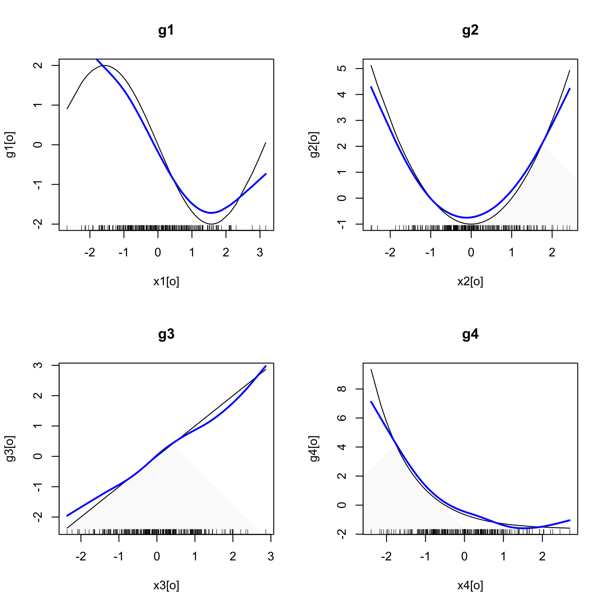

[](http://quantlet.de/)

## [](http://quantlet.de/) **SPMAdditivecorrelated** [](http://quantlet.de/)

```yaml

Name of QuantLet : SPMAdditivecorrelated

Published in : Nonparametric and Semiparametric Models

Description : Computes an additive fit with normal and correlated regressors.

Keywords : nonparametric, regression, plot, graphical representation, normal

See also : SPMadditive, SPMadditivebostonh, SPMgamkredit

Author : Marlene Müller

Submitted : Mon, August 01 2011 by Awdesch Melzer

Example : Plot of the regression and data points.

```




### R Code:
```r

# clear variables and close windows
rm(list = ls(all = TRUE))
graphics.off()

# install and load packages
libraries = c("gam", "mvtnorm")
lapply(libraries, function(x) if (!(x %in% installed.packages())) {
install.packages(x)
})
lapply(libraries, library, quietly = TRUE, character.only = TRUE)

n = 250
rho = 0.7
mu = rep(0, 4)
sigma = matrix(rho, 4, 4) + (1 - rho) * diag(4)
x = rmvnorm(n, sigma = sigma)

x1 = x[, 1]
x2 = x[, 2]
x3 = x[, 3]
x4 = x[, 4]

g1 = -2 * sin(x1)
g2 = x2^2 - 1
g3 = x3
g4 = exp(-x4) - exp(0.5)
y = g1 + g2 + g3 + g4 + rnorm(n)
print(c(mean(g1), mean(g2), mean(g3), mean(g4)))

am = gam(y ~ s(x1) + s(x2) + s(x3) + s(x4), family = gaussian)
# am = gam( y ~ s(x1) + s(x2) + s(x3) + s(x4) , family=gaussian)
print(summary(am))

b = coef(am)

# plot
par(mfrow = c(2, 2))

o = order(x1)
plot(x1[o], g1[o], type = "l", main = "g1")
lines(x1[o], x1[o] * b[2] + am$smooth[o, 1], col = "blue", lwd = 2)
rug(x1)

o = order(x2)
plot(x2[o], g2[o], type = "l", main = "g2")
lines(x2[o], x2[o] * b[3] + am$smooth[o, 2], col = "blue", lwd = 2)
rug(x2)

o = order(x3)
plot(x3[o], g3[o], type = "l", main = "g3")
lines(x3[o], x3[o] * b[4] + am$smooth[o, 3], col = "blue", lwd = 2)
rug(x3)

o = order(x4)
plot(x4[o], g4[o], type = "l", main = "g4")
lines(x4[o], x4[o] * b[5] + am$smooth[o, 4], col = "blue", lwd = 2)
rug(x4)

par(mfrow = c(1, 1))

```
