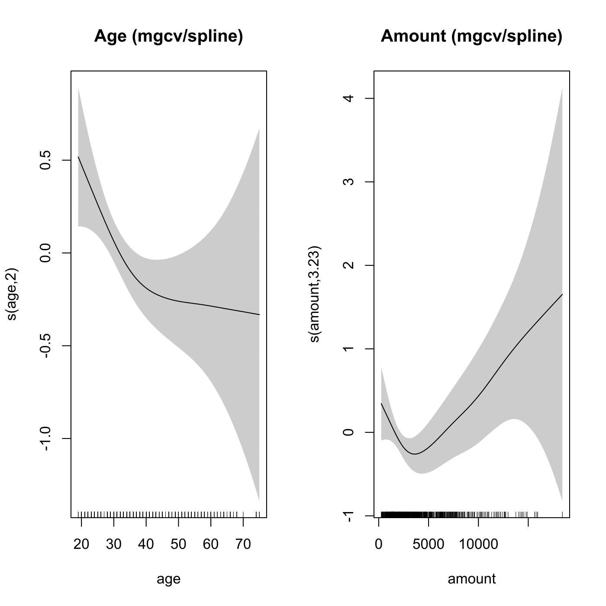

[](http://quantlet.de/)

## [](http://quantlet.de/) **SPMgamkredit** [](http://quantlet.de/)

```yaml

NAme of QuantLet : SPMgamkredit

Published in : Nonparametric and Semiparametric Models

Description : 'Computes a semiparametric logit model with additive component functions for Age and
Amount using mgcv.'

Keywords : 'nonparametric, regression, plot, graphical representation, data visualization,
financial, logit, semiparametric, semiparametric model'

See also : SPMadditive, SPMadditivebostonh, SPMadditivecorrelated

Author : Marlene Müller

Submitted : Mon, August 01 2011 by Awdesch Melzer

Datafiles : kredit.csv

Example : Plot of the regression and data points.

```




### R Code:
```r

# clear variables and close windows
rm(list = ls(all = TRUE))
graphics.off()

# install and load packages
libraries = c("gam", "mgcv")
lapply(libraries, function(x) if (!(x %in% installed.packages())) {
install.packages(x)
})
lapply(libraries, library, quietly = TRUE, character.only = TRUE)

# load data
file = read.csv("kredit.csv", sep = ";")

y = 1 - file$kredit  # default set to 1
prev = (file$moral > 2) + 0  # previous loans were OK
employ = (file$beszeit > 1) + 0  # employed (>=1 year)
dura = (file$laufzeit)  # duration
d9.12 = ((file$laufzeit > 9) & (file$laufzeit <= 12)) + 0  #  9 < duration <= 12
d12.18 = ((file$laufzeit > 12) & (file$laufzeit <= 18)) + 0  # 12 < duration <= 18
d18.24 = ((file$laufzeit > 18) & (file$laufzeit <= 24)) + 0  # 18 < duration <= 24
d24 = (file$laufzeit > 24) + 0  # 24 < duration
amount = file$hoehe  # amount of loan
age = file$alter  # age of applicant
savings = (file$sparkont > 4) + 0  # savings >= 1000 DM
phone = (file$telef == 1) + 0  # applicant has telephone
foreign = (file$gastarb == 1) + 0  # non-german citizen
purpose = ((file$verw == 1) | (file$verw == 2)) + 0  # loan is for a car
house = (file$verm == 4) + 0  # house owner

gam11 = gam(y ~ s(age) + s(amount) + prev + employ + d9.12 + d12.18 + d18.24 + d24 + 
    savings + purpose + house, family = binomial)
summary(gam11)

# plot
par(mfrow = c(1, 2))
plot.gam(gam11, select = 1, scale = 0, pages = 0, shade = TRUE, main = "Age (mgcv/spline)")  # # FALSE)
plot.gam(gam11, select = 2, scale = 0, pages = 0, shade = TRUE, main = "Amount (mgcv/spline)")  # # FALSE)
par(mfrow = c(1, 1))


```
