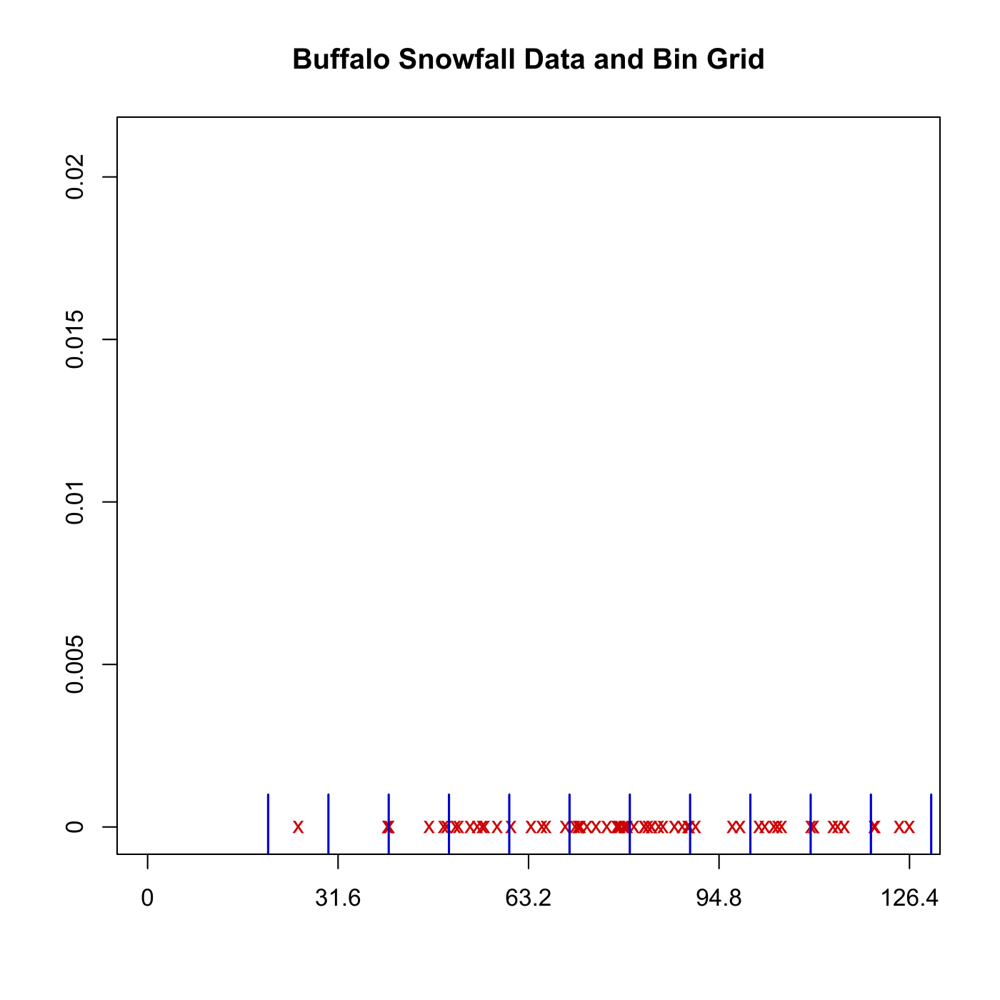

[](http://quantlet.de/)

## [](http://quantlet.de/) **SPMbuffagrid** [](http://quantlet.de/)

```yaml

Name of QuantLet : SPMbuffagrid

Published in : Nonparametric and Semiparametric Models

Description : Illustrates Buffalo snowfall data with bin grid.

Keywords : plot, graphical representation, data visualization

See also : SPMbuffahisto, SPMbuffadata

Author : Awdesch Melzer

Submitted : Wed, October 24 2012 by Dedy Dwi Prastyo

Datafiles : buffa.dat

```




### R Code:
```r

# clear variables and close windows
rm(list = ls(all = TRUE))
graphics.off()

y = 2:13
y = y * 10
y = cbind(y, y)

# load data
x = read.table("buffa.dat")
x = cbind(x, matrix(0, nrow(x), 1))

# plot
plot(x, axes = F, frame = T, ylim = c(0, 0.021), xlim = c(0, 126.4), pch = "x", col = "red3", 
    xlab = "", ylab = "", main = "Buffalo Snowfall Data and Bin Grid")
axis(1, seq(0, max(x[, 1]), length = 5), round(seq(0, max(x[, 1]), length = 5), 2))
axis(2, seq(0, 0.021, 0.005), seq(0, 0.021, 0.005))
for (i in 1:nrow(y)) {
    lines(y[i, ], rbind(-0.001, 0.001), col = "blue3", lwd = 1.5)
}


```
