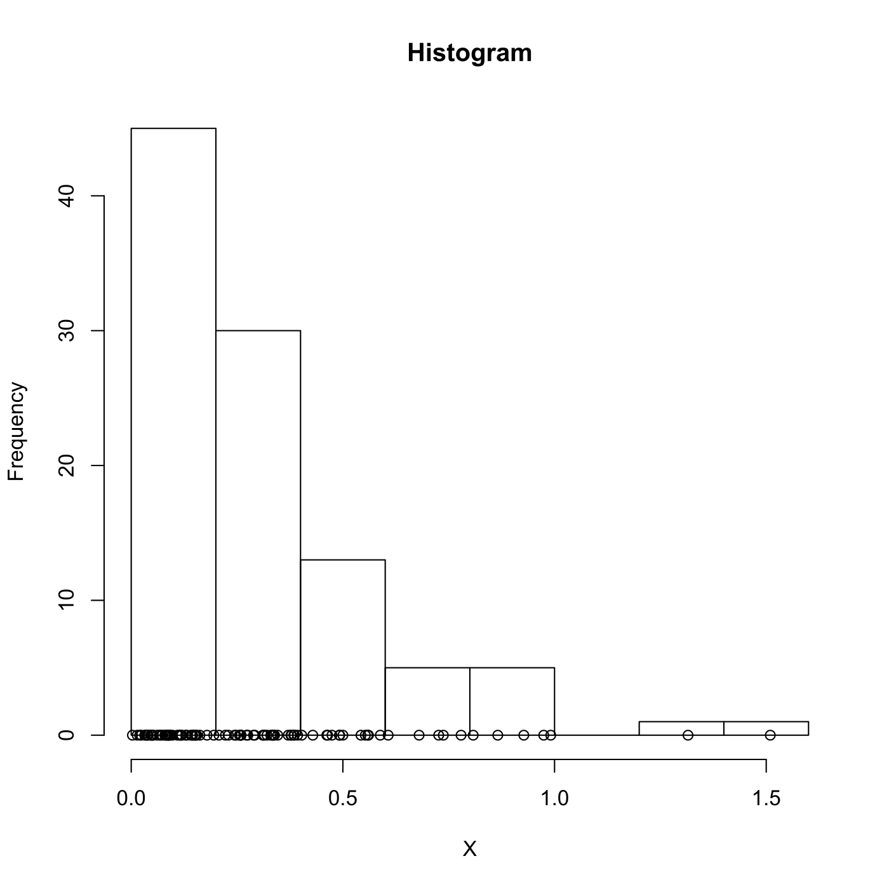

[](http://quantlet.de/)

## [](http://quantlet.de/) **SPMsimulatedexponential** [](http://quantlet.de/)

```yaml

Name of QuantLet : SPMsimulatedexponential

Published in : Nonparametric and Semiparametric Models

Description : Illustrates a histogram of an exponential distribution.

Keywords : histogram, exponential, distribution, simulation, plot, graphical representation

Author : Awdesch Melzer

Submitted : Thu, October 25 2012 by Dedy Dwi Prastyo

```




### R Code:
```r

# clear variables and close windows
rm(list = ls(all = TRUE))
graphics.off()

set.seed(0)

n     = 100
beta  = 0.35
data  = -beta * log(runif(n, 0, 1))
histo = hist(data, plot = F)
data  = cbind(data, (0 * data))

# plot
plot(histo, main = "Histogram", xlab = "X", ylab = "Frequency")
points(data)

```
