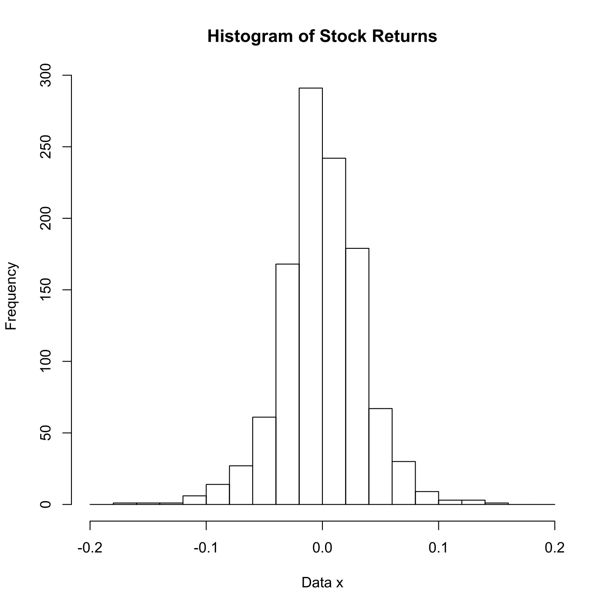

[](http://quantlet.de/)

## [](http://quantlet.de/) **SPMstockreturnhisto** [](http://quantlet.de/)

```yaml

Name of QuantLet : SPMstockreturnhisto

Published in : Nonparametric and Semiparametric Models

Description : Illustrates a histogram of stock returns.

Keywords : plot, graphical representation, data visualization, histogram, financial, returns, asset

See also : SPMhiststock, SPMhistogram, SPMashstock, SPMbuffahisto, SPMHistoConstruct, SPMhistobias2

Author : Awdesch Melzer

Submitted : Wed, October 24 2012 by Dedy Dwi Prastyo

Datafiles : stockres.dat

```




### R Code:
```r

# clear variables and close windows
rm(list = ls(all = TRUE))
graphics.off()

# load data
x = read.table("stockres.dat")
y = seq(-0.2, 0.2, 0.02)

# plot
his = hist(as.matrix(x), y, xlab = "Data x", main = "Histogram of Stock Returns")

```
