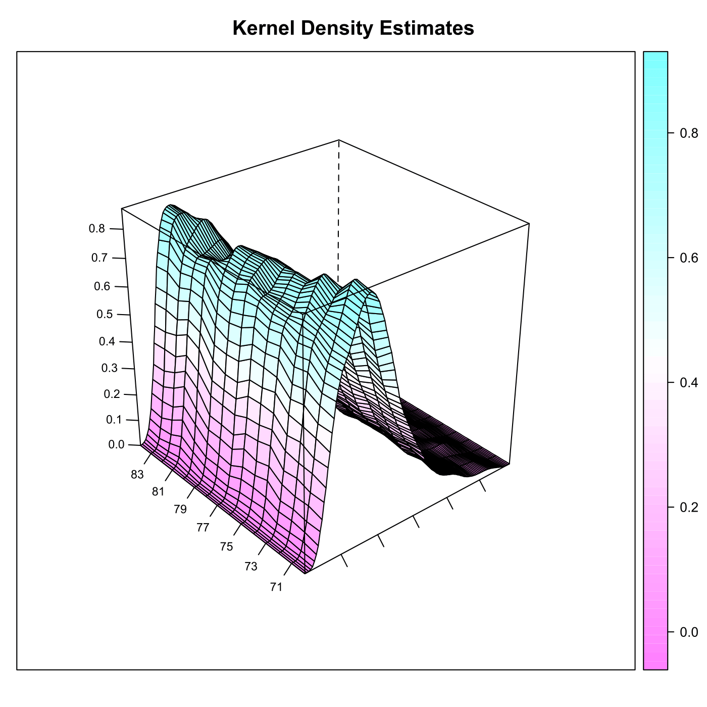
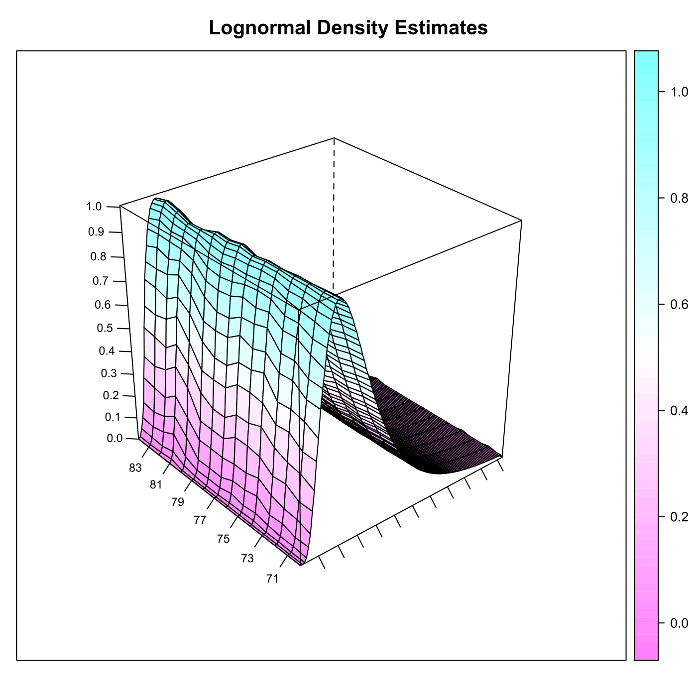

[](http://quantlet.de/)

## [](http://quantlet.de/) **SPMfesdensities** [](http://quantlet.de/)

```yaml

Name of QuantLet : SPMfesdensities

Published in : Nonparametric and Semiparametric Models

Description : 'Estimates the densities of netincome for all years (1969-83) from the UK family
expenditure survey (FES).'

Keywords : 'estimation, kernel, density, lognormal, kde, financial, plot, graphical representation,
data visualization'

Author : Awdesch Melzer

Submitted : Wed, October 24 2012 by Dedy Dwi Prastyo

Datafiles : 'agg69sh.dat, agg70sh.dat, agg71sh.dat, agg72sh.dat, agg74sh.dat, agg75sh.dat,
agg76sh.dat, agg77sh.dat, agg78sh.dat, agg79sh.dat, agg80sh.dat, agg81sh.dat, agg82sh.dat,
agg83sh.dat'

Code warning : '15 warning messages: In log(fhj[, 1]) : NaNs produced'

```






### R Code:
```r

# clear variables and close windows
rm(list = ls(all = TRUE))
graphics.off()

# install and load packages
libraries = c("KernSmooth", "lattice")
lapply(libraries, function(x) if (!(x %in% installed.packages())) {
install.packages(x)
})
lapply(libraries, library, quietly = TRUE, character.only = TRUE)

# parameter settings
h = 0.2  # bandwidth
first = 69  # first year
last = 83  # last year

# main calculation
ny = last - first + 1
j = first - 1
while (j < last) {
    j = j + 1
    fname = toString(paste("agg", j, "sh.dat", sep = ""))
    # 'reading '+fname
    # load data
    xj = read.table(fname)
    xj = xj[, 1]
    d = (max(xj) - min(xj))/100
    
    fhj1 = bkde(xj, h, kernel = "epanech")$x
    fhj2 = bkde(xj, h, kernel = "epanech")$y  # kernel density
    fhj = cbind(fhj1, fhj2)
    
    tmp = log(as.matrix(xj))
    mu = mean(tmp)
    s2 = var(tmp)
    flj = (exp(-(log(fhj[, 1]) - mu)^2/(2 * s2))/(sqrt(2 * pi * s2) * fhj[, 1]))  # lognormal
    
    xgj = round((fhj[, 1] - 0.5 * d)/d)  # gridpoints
    fhj = fhj[, 2]  # kernel
    
    if (j == first) {
        # for first specification
        mj = max(xgj)  # grid max
        ij = min(xgj)  # grid min
        xg = ij:mj  # new grid
        tmp = matrix(0, length(xg), 1)
        fh = tmp
        fl = tmp
        xgj = xgj - ij + 1
        fh[xgj] = c(fhj)
        fl[xgj] = c(flj)
    } else {
        # later specification
        mj = max(xgj)
        ij = min(xgj)
        mx = max(xg)
        ix = min(xg)
        if (mj > mx) {
            # adding values at the end
            xg = rbind(xg, ((mx + 1):mj))
            fh = rbind(fh, matrix(0, mj - mx, ncol(cbind(fh))))
            fl = rbind(fl, matrix(0, mj - mx, ncol(cbind(fl))))
        }
        if (ij < ix) {
            # adding values at the front
            xg = rbind(c(ij:(ix - 1)), xg)
            fh = rbind(matrix(0, ix - ij, ncol(cbind(fh))), fh)
            fl = rbind(matrix(0, ix - ij, ncol(fl)), fl)
        }
        tmp = matrix(0, nrow(xg), 1)
        fh = cbind(fh, tmp)
        fl = cbind(fl, tmp)
        # update of fh, fl
        xgj = xgj - ij + 1
        fh[xgj, j - first + 1] = fhj
        fl[xgj, j - first + 1] = flj
    }
    # update on fh, fl, xg
    tmp = cbind(fh, fl, xg)
    # tmp=subset(tmp,abs(apply(tmp,1,sum))>0)
    fh = cbind(tmp[, 1:ncol(fh)])
    fl = cbind(tmp[, (ncol(fh) + 1):(ncol(tmp) - 1)])
    xg = cbind(tmp[, ncol(tmp)])
}

fl = fl[7:nrow(fl), ]
xgl = xg[7:length(xg)]
nx = nrow(xg)

# plot
wireframe(fh, aspect = c(1, 1), drape = T, main = "Kernel Density Estimates", scales = list(arrows = FALSE, 
    col = "black", distance = 1, tick.number = 8, cex = 0.7, y = list(labels = round(seq(69, 
        83, length = 8), 1)), x = list(labels = rep("", length = 12))), xlab = list("", 
    rot = 30, cex = 1.2), ylab = list("", rot = -40, cex = 1.2), zlab = list("", cex = 1.1))
# persp(xg,seq(69,83,1),fh,scale=T,col='white',box=T,axes=T,
# ticktype='detailed',xlab='',ylab='',zlab='', main='Kernel Density
# Estimates',nticks=8,phi=30, theta=-30)

# plot
dev.new()
# persp(xgl,seq(69,83,1),fl,scale=T,col='white',box=T,axes=T,
# ticktype='detailed',xlab='',ylab='',zlab='', main='Lognormal Density
# Estimates',nticks=8,phi=30, theta=-30)
wireframe(fl, aspect = c(1, 1), drape = T, main = "Lognormal Density Estimates", scales = list(arrows = FALSE, 
    col = "black", distance = 1, tick.number = 8, cex = 0.7, y = list(labels = round(seq(69, 
        83, length = 8), 1)), x = list(labels = rep("", length = 12))), xlab = list("", 
    rot = 30, cex = 1.2), ylab = list("", rot = -40, cex = 1.2), zlab = list("", cex = 1.1))
list(xgl, fl, xg, fh)


```
