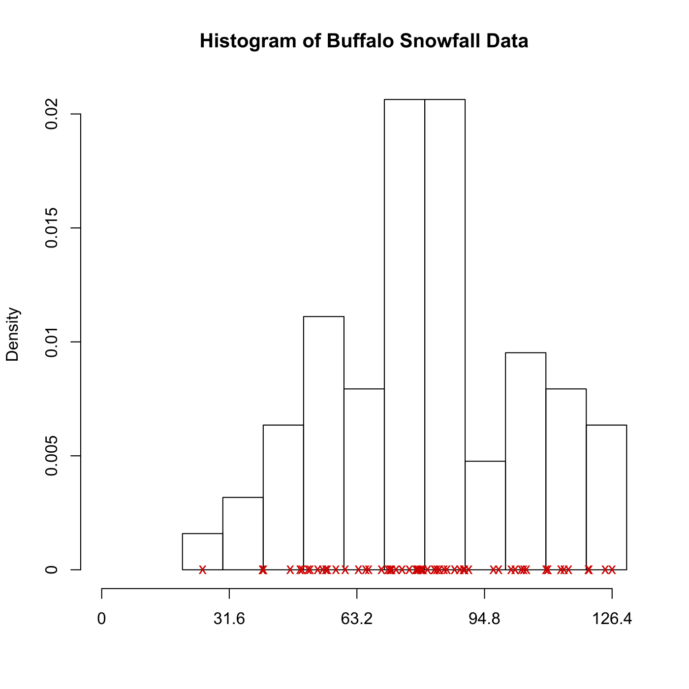

[](http://quantlet.de/)

## [](http://quantlet.de/) **SPMbuffahisto** [](http://quantlet.de/)

```yaml

Name of QuantLet : SPMbuffahisto

Published in : Nonparametric and Semiparametric Models

Description : Illustrates a mean squared error (MSE) of histogram for Buffalo snowfall data.

Keywords : plot, graphical representation, data visualization, histogram, mse

See also : SPMbuffagrid, SPMbuffadata

Author : Awdesch Melzer

Submitted : Mon, October 29 2012 by Dedy Dwi Prastyo

Datafiles : buffa.dat

```




### R Code:
```r

# clear variables and close windows
rm(list = ls(all = TRUE))
graphics.off()

# load data
x = read.table("buffa.dat")

origin   = 20   # starting point of histogrom
binwidth = 10   # binwidth of histogram
maxgrid  = 130  # last bin point

plothist = function(x, origin, binwidth, maxgrid) {
    if (missing(x) == T) {
        stop("Please insert a data vector")
    }
    if (missing(origin) == T) {
        origin = 20  # default value
    }
    if (missing(binwidth) == T) {
        binwidth = 10  # default value
    }
    if (missing(maxgrid) == T) {
        maxgrid = 130  # default value
    }
    grid = seq(origin, maxgrid, binwidth)  # computing grid
    if (max(grid) < max(x)) {
        # if data range exceeds grid hist() can't produce the histogram
        stop("Please change either binwidth or maxgrid, such that the largest value of x is included")
    }
    his = hist(as.matrix(x), grid, probability = T, xlim = c(0, max(x, grid)), axes = F, 
        xlab = "", main = "")
    axis(1, seq(0, max(x[, 1]), length = 5), round(seq(0, max(x[, 1]), length = 5), 
        2))
    axis(2, seq(0, 0.021, 0.005), seq(0, 0.021, 0.005))
    title("Histogram of Buffalo Snowfall Data")
    x = cbind(x, matrix(0, nrow(x), 1))
    points(x, pch = "x", col = "red3")
}

plothist(x, origin, binwidth, maxgrid)
```
