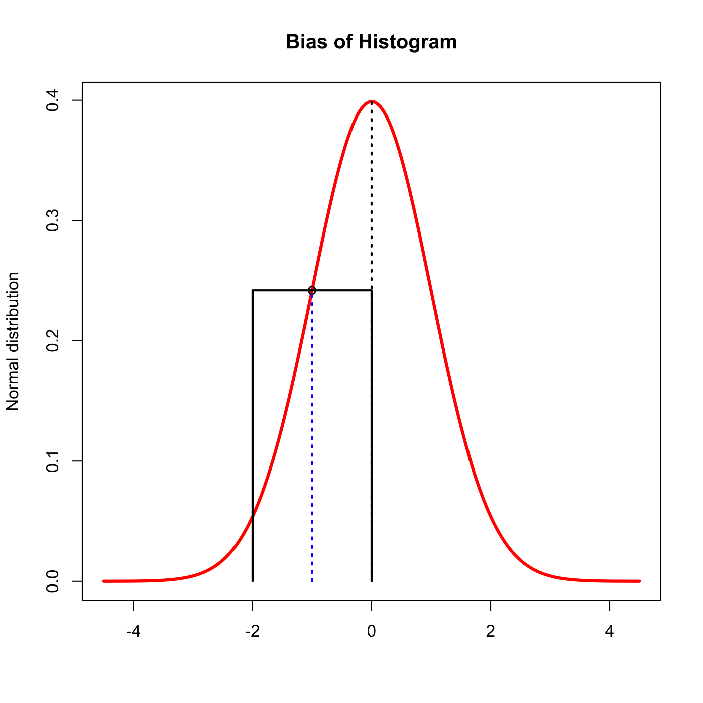

[](http://quantlet.de/)

## [](http://quantlet.de/) **SPMhistobias2** [](http://quantlet.de/)

```yaml

Name of QuantLet : SPMhistobias2

Published in : Nonparametric and Semiparametric Models

Description : Illustrates bias of a histogram.

Keywords : plot, graphical representation, histogram, bias

See also : 'SPMhiststock, SPMhistogram, SPMashstock, SPMbuffahisto, SPMHistoConstruct,
SPMstockreturnhisto'

Author : Awdesch Melzer

Submitted : Mon, October 29 2012 by Dedy Dwi Prastyo

```




### R Code:
```r

# clear variables and close windows
rm(list = ls(all = TRUE))
graphics.off()

norm = seq(-4.5, 4.5, 0.05)
normline = cbind(norm, dnorm(norm))
plot(normline, type = "l", col = "red", lwd = 3, ylab = "Normal distribution", main = "Bias of Histogram", 
    xlab = "")

x0 = cbind(c(0, 0), c(0, dnorm(0)))

# plot
lines(x0, lty = "dotted", lwd = 2)
lines(c(-2, -2), c(0, dnorm(-1)), lwd = 2)
lines(c(0, 0), c(0, dnorm(-1)), lwd = 2)
lines(c(-2, 0), c(dnorm(-1), dnorm(-1)), lwd = 2)
points(c(-1, -1), c(-1, dnorm(-1)), pch = "o", lwd = 2)
lines(c(-1, -1), c(0, dnorm(-1)), col = "blue", lty = "dotted", lwd = 2)


```
