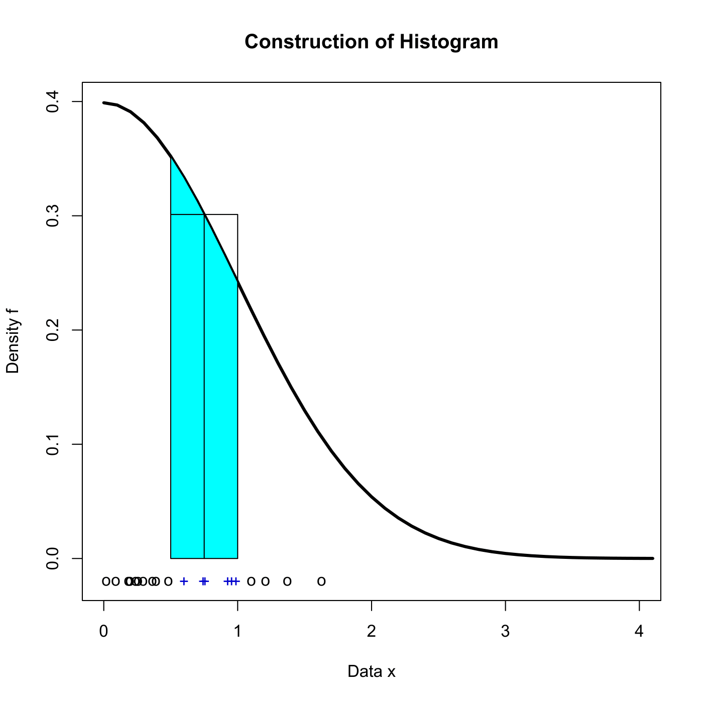

[](http://quantlet.de/)

## [](http://quantlet.de/) **SPMHistoConstruct** [](http://quantlet.de/)

```yaml

Name of QuantLet : SPMHistoConstruct

Published in : Nonparametric and Semiparametric Models

Description : Illustrates a construction of histogram.

Keywords : plot, graphical representation, histogram, density

See also : 'SPMhisdiffbin, SPMhisdiffori, SPMhistmse, SPMhiststock, SPMstockreturnhisto,
SPMhistogram, SPMhistobias2, SPMbuffahisto'

Author : Awdesch Melzer

Submitted : Mon, October 29 2012 by Dedy Dwi Prastyo

```




### R Code:
```r

# clear variables and close windows
rm(list = ls(all = TRUE))
graphics.off()

# parameter settings
set.seed(10)
n  = 20   # number of observations
b0 = 0.5  # lower bound of bin
b1 = 1    # upper bound of bin 

x   = abs(rnorm(n, 0, 1))                        # absolute normal random numbers
xb  = subset(x, ((x <= b1) & (x >= b0)))         # data inside bin
x.o = subset(x, (x > b1) | (x < b0))             # data outside bin
xb  = cbind(xb, matrix(-0.02, length(xb), 1))    # set 0.02 below x axis
x.o = cbind(x.o, matrix(-0.02, length(x.o), 1))  # set 0.02 below x axis

grid = seq(0, 4.1, 0.1)  # grid
densgrid = cbind(grid, dnorm(grid))  # normal density over grid

# construction of bin
binmid = (b0 + b1)/2
fm = rbind(c(b0, dnorm(b0, 0, 1)), c(b0, dnorm(binmid, 0, 1)), c(binmid, dnorm(binmid, 
    0, 1)), c(binmid, 0))
fm = rbind(fm, c(binmid, dnorm(binmid, 0, 1)), c(b1, dnorm(binmid, 0, 1)), c(b1, dnorm(b1, 
    0, 1)))

plot(densgrid, type = "l", col = "black", lwd = 3, xlim = c(0, 4), ylab = "Density f", 
    xlab = "Data x", ylim = c(-0.02, 0.4))
title("Construction of Histogram")

# fillarea
gridarea = subset(grid, ((grid <= b1) & (grid >= b0)))
fillarea = dnorm(gridarea, 0, 1)
polygon(c(min(gridarea), gridarea, max(gridarea)), c(min(fillarea, 0), fillarea, min(fillarea, 
    0)), col = "cyan")
points(x.o, pch = "o", col = "black")
points(xb, pch = "+", col = "blue3")
lines(fm)

```
