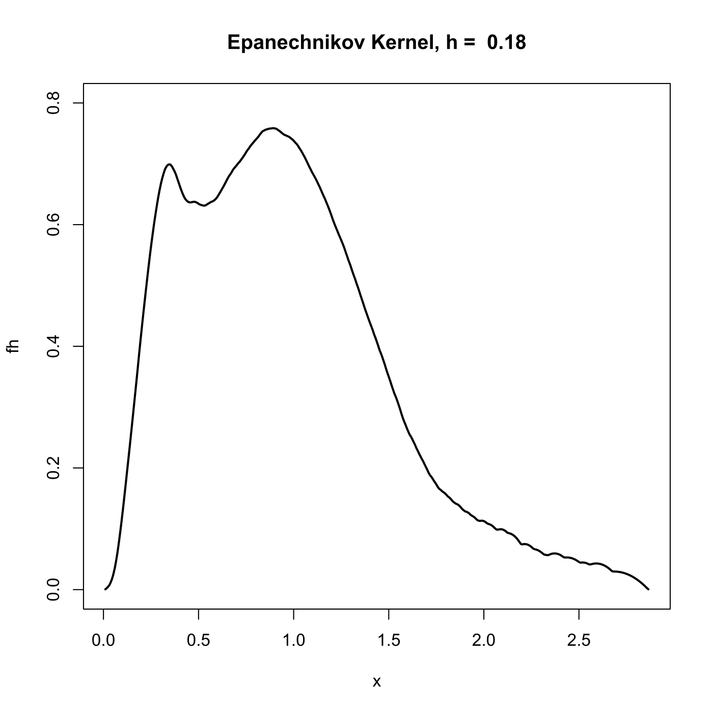
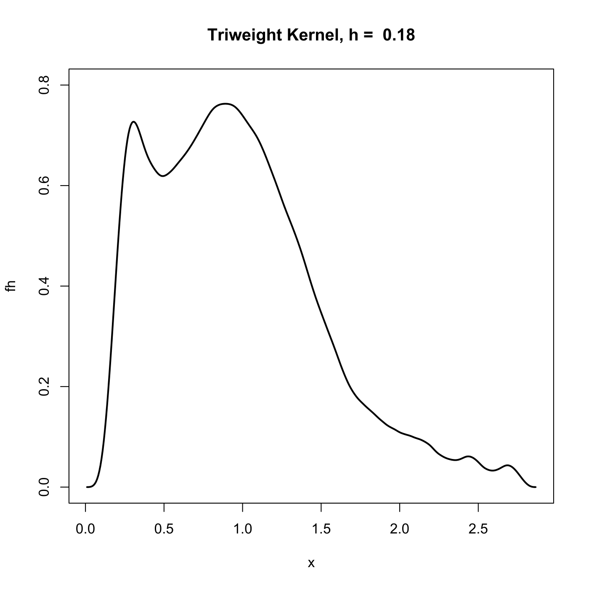

[](http://quantlet.de/)

## [](http://quantlet.de/) **SPMdenepatri** [](http://quantlet.de/)

```yaml

Name of QuantLet : SPMdenepatri

Published in : Nonparametric and Semiparametric Models

Description : 'Computes a kernel estimation of epanechnikov and triangle kernel for net-income data
from the U.K. Family Expenditure Survey.'

Keywords : kernel, kde, estimation, financial, plot, graphical representation, data visualization

See also : MVAkernelfunctions

Author : Awdesch Melzer

Submitted : Thu, November 01 2012 by Dedy Dwi Prastyo

Datafiles : nicfoo.dat

```






### R Code:
```r

# clear variables and close windows
rm(list = ls(all = TRUE))
graphics.off()

# install and load packages
libraries = c("KernSmooth")
lapply(libraries, function(x) if (!(x %in% installed.packages())) {
install.packages(x)
})
lapply(libraries, library, quietly = TRUE, character.only = TRUE)

# load data
x = read.table("nicfoo.dat")
x = x[, 1]

h = 0.18  # set bandwidth
fh1 = bkde(x, bandwidth = h, "epanech")  # density estimation using 'epanechnikov' kernel
fh2 = bkde(x, bandwidth = h, "triweight")  # density estimation using 'triweight' kenel

# plot
plot(fh1, type = "l", lwd = 2, ylab = "fh", xlab = "x", ylim = c(0, 0.8))
title(paste("Epanechnikov Kernel, h = ", h))

# plot
dev.new()
plot(fh2, type = "l", lwd = 2, ylab = "fh", xlab = "x", ylim = c(0, 0.8))
title(paste("Triweight Kernel, h = ", h))


```
