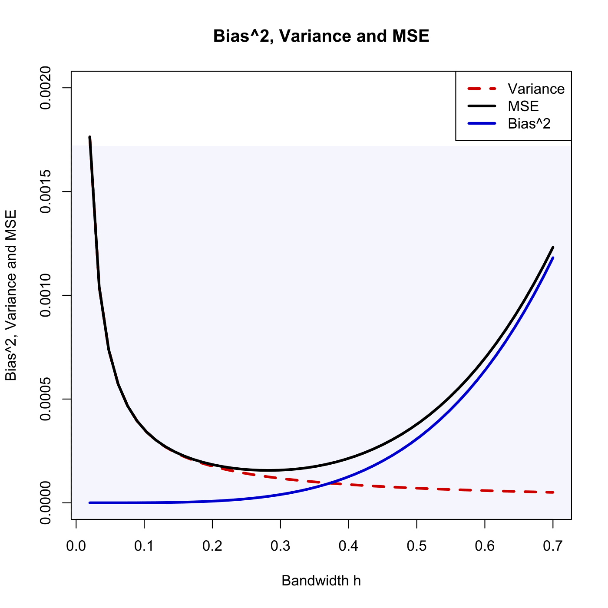

[](http://quantlet.de/)

## [](http://quantlet.de/) **SPMkdemse** [](http://quantlet.de/)

```yaml

Name of QuantLet : SPMkdemse

Published in : Nonparametric and Semiparametric Models

Description : 'Visualizes bias^2, variance and mean squared error (MSE) for a kernel density
estimate.'

Keywords : plot, graphical representation, bias, variance, mse, kernel, density, kde

See also : SPMkdebias, SPMkdebias_sim, SPMkde2D, SPMkdeconstruct, SPMkdeconstruct-Sliders

Author : Awdesch Melzer

Submitted : Mon, November 12 2012 by Dedy Dwi Prastyo

```




### R Code:
```r

# clear variables and close windows
rm(list = ls(all = TRUE))
graphics.off()

# parameter settings
phi = 0.4   # probability of choosing distribution one
mu  = -3    # mean of distribution one
mu2 = 1     # second moment
x0  = -1.2  # point at which the kernel density is to be evaluated

h  = seq(0.02, 0.7, length = 50)  # vector of bandwidth
n  = 1000                         # sample size
ck = 1/(2 * sqrt(pi))             # L2 norm of the Kernel

ff  = phi * dnorm(x0) + (1 - phi) * dnorm(x0 - mu)                           # true density
f2  = phi * (x0^2) * dnorm(x0) + (1 - phi) * ((x0 - mu)^2) * dnorm(x0 - mu)  # its second derivative
f2  = f2 - phi * dnorm(x0) - (1 - phi) * dnorm(x0 - mu)                      # minus true density
b   = h^2 * f2 * mu2/2  # bias
b2  = b^2               # squared bias
v   = ff * ck/(n * h)   # variance
mse = b2 + v            # mean squared error

# plot
plot(h, v, ylim = c(0, 0.002), type = "l", lwd = 3, lty = 2, col = "red3", xlab = "Bandwidth h", 
    ylab = "Bias^2, Variance and MSE")
title("Bias^2, Variance and MSE")
lines(h, mse, lwd = 3, col = "black")
lines(h, b2, lwd = 3, col = "blue3")
legend("topright", c("Variance", "MSE", "Bias^2"), lty = c(2, 1, 1), lwd = c(3, 3, 
    3), col = c("red3", "black", "blue3"))


```
