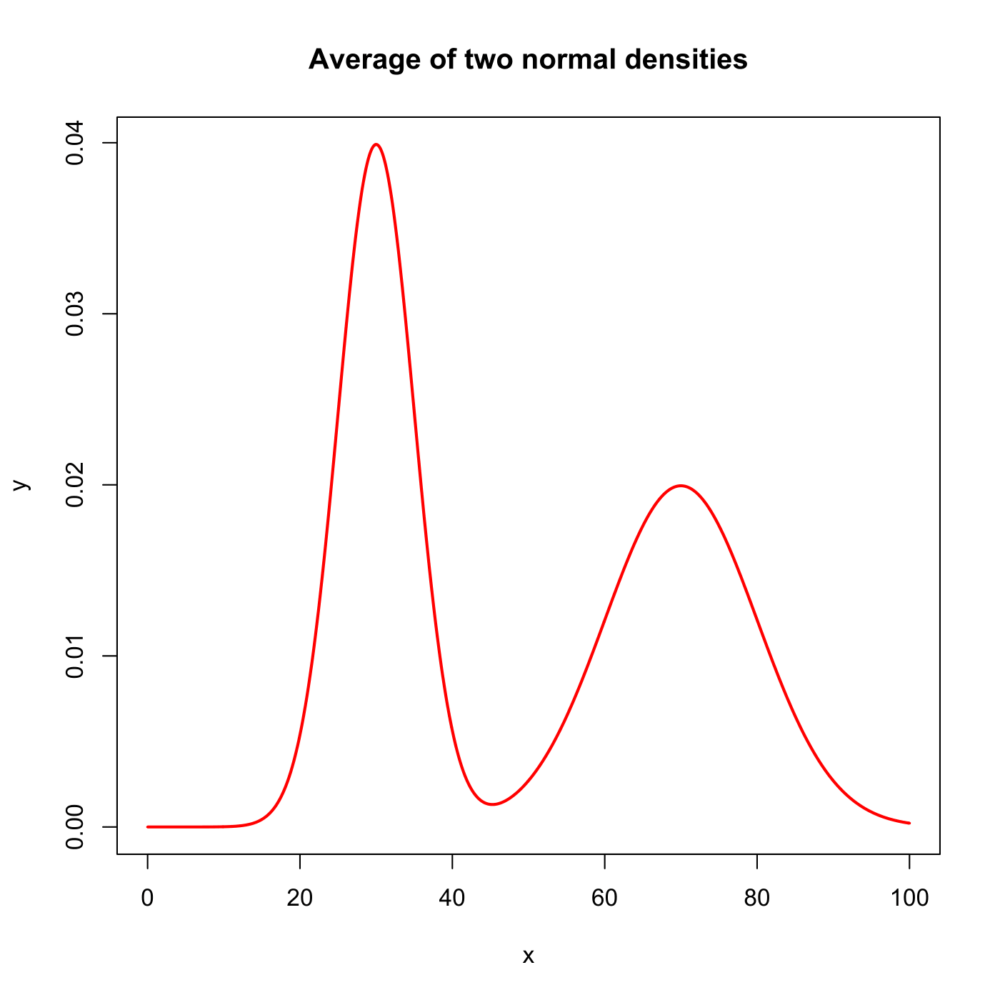
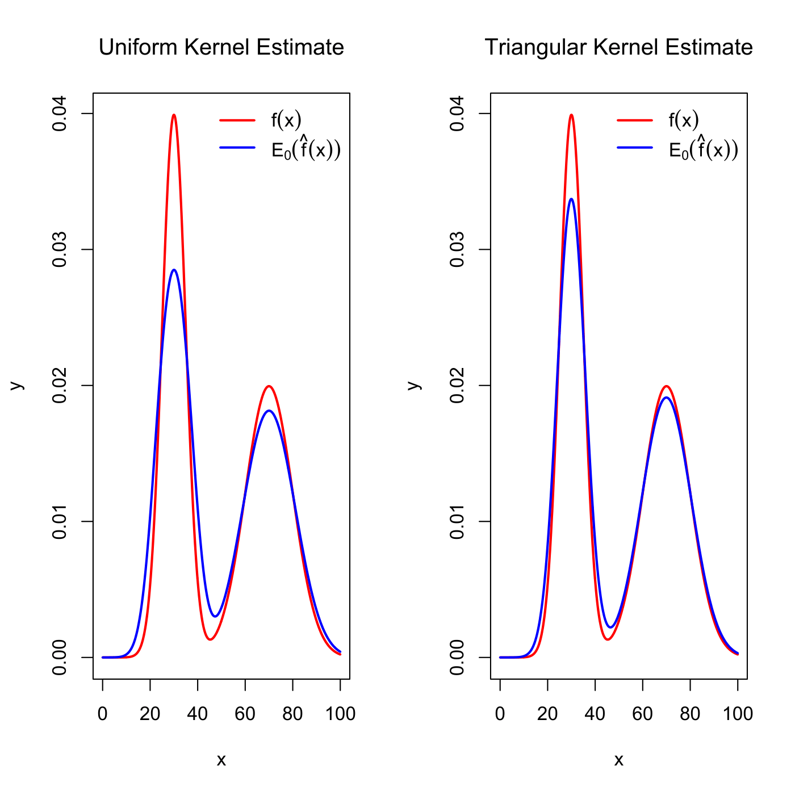

[](http://quantlet.de/)

## [](http://quantlet.de/) **SPMkdebias_sim** [](http://quantlet.de/)

```yaml

Name of QuantLet : SPMkdebias_sim

Published in : Nonparametric and Semiparametric Models

Description : Visualizes bias effects for a kernel density estimate via simulation n = 10000.

Keywords : plot, graphical representation, bias, kernel, density, kde, simulation, normal, uniform

See also : SPMkdemse, SPMkdebias, SPMkde2D, SPMkdeconstruct, SPMkdeconstruct-Sliders

Author : Chong Liang

Submitted : Mon, November 12 2012 by Dedy Dwi Prasty

```






### R Code:
```r

# clear variables and close windows
rm(list = ls(all = TRUE))
graphics.off()

# parameter settings
x = seq(0, 100, 0.1)  # set sequence
n = 10000             # number of samples

ydf = function(x) {
    mu1    = 30
    sigma1 = 5
    mu2    = 70
    sigma2 = 10
    (dnorm(x, mean = mu1, sd = sigma1) + dnorm(x, mean = mu2, sd = sigma2))/2
}
y = ydf(x)  # # this is the underlying density function I want to estimate

# plot
plot(x, y, lwd = 2, col = "red", type = "l", main = "Average of two normal densities")

# simulate according to the density function y
U1 = runif(n, min = 0, max = 100)
U2 = runif(n)
Sample = U1[U2 < ydf(U1)]

# estimate according to uniform kernel
yhat = density(Sample, bw = "nrd0", kernel = "rectangular", from = 0, to = 100)

# compute expectation of yhat
s = runif(n, min = -1)
h = yhat$bw
Eyhat = 0
for (i in 1:length(yhat$x)) {
    Eyhat[i] = (mean(ydf(yhat$x[i] + h * s)) * 2)/2
}

# with triangular kernel
yhat2 = density(Sample, bw = "nrd0", kernel = "triangular", from = 0, to = 100)
s = runif(n, min = -1)
h2 = yhat2$bw
Eyhat2 = 0
for (i in 1:length(yhat2$x)) {
    Eyhat2[i] = mean((1 - abs(s)) * (ydf(yhat2$x[i] + h2 * s))) * 2
}

# plot
dev.new()
par(mfrow = c(1, 2))
plot(x, y, type = "l", lwd = 2, col = "red", main = "Uniform Kernel Estimate", font.main = 1)
lines(yhat$x, Eyhat, lwd = 2, col = "blue")
legend.txt = expression(f(x), E[0](hat(f)(x)))
legend("topright", legend = legend.txt, col = c("red", "blue"), lwd = c(2, 2), bty = "n")

plot(x, y, type = "l", lwd = 2, col = "red", main = "Triangular Kernel Estimate", font.main = 1)
lines(yhat2$x, Eyhat2, lwd = 2, col = "blue")
legend.txt = expression(f(x), E[0](hat(f)(x)))
legend("topright", legend = legend.txt, col = c("red", "blue"), lwd = c(2, 2), bty = "n")


```
