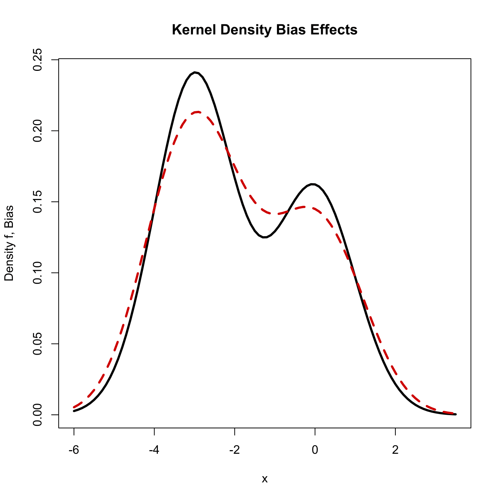

[](http://quantlet.de/)

## [](http://quantlet.de/) **SPMkdebias** [](http://quantlet.de/)

```yaml

Name of QuantLet : SPMkdebias

Published in : Nonparametric and Semiparametric Models

Description : Visualizes bias effects for a kernel density estimate.

Keywords : plot, graphical representation, bias, kernel, density, kde

See also : SPMkdemse, SPMkdebias_sim, SPMkde2D, SPMkdeconstruct, SPMkdeconstruct-Sliders

Author : Awdesch Melzer

Submitted : Thu, November 29 2012 by Dedy Dwi Prastyo

```




### R Code:
```r

# clear variables and close windows
rm(list = ls(all = TRUE))
graphics.off()

# parameter settings
phi = 0.4                # probability of choosing density one
mu  = -3                 # mean
xg  = seq(-6, 3.5, 0.1)  # grid

ff = phi * dnorm(xg) + (1 - phi) * dnorm(xg - mu)  # true density

h   = 0.5  # bandwidth
mu2 = 1    # second moment

f2 = phi * (xg^2) * dnorm(xg) + (1 - phi) * ((xg - mu)^2) * dnorm(xg - mu)
f2 = f2 - phi * dnorm(xg) - (1 - phi) * dnorm(xg - mu)  # second derivative of the true density
fb = ff + h^2 * f2 * mu2/2  # bias

# plot
plot(xg, ff, xlab = "x", ylab = "Density f, Bias", type = "l", lwd = 3)
title("Kernel Density Bias Effects")
lines(xg, fb, lwd = 3, lty = 2, col = "red3")

```
