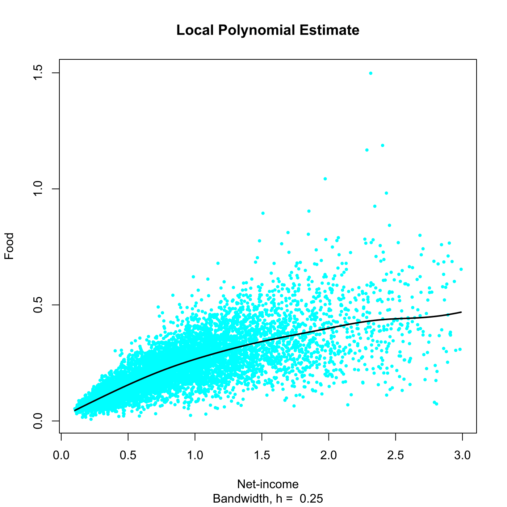

[](http://quantlet.de/)

## [](http://quantlet.de/) **SPMlocpolyest** [](http://quantlet.de/)

```yaml

Name of QuantLet : SPMlocpolyest

Published in : Nonparametric and Semiparametric Models

Description : 'Computes the local polynomial estimator for the UK 1973 expenditure data employing a
gaussian kernel.'

Keywords : 'kernel, gaussian, local polynomial, estimation, financial, plot, graphical
representation, data visualization'

See also : SPMnadwaest, SPMderivest, SPMlocpolyderivative, SPMlocpolyregression

Author : Awdesch Melzer

Submitted : Wed, December 12 2012 by Dedy Dwi Prastyo

Datafiles : agg73sh.dat

```




### R Code:
```r

# clear variables and close windows
rm(list = ls(all = TRUE))
graphics.off()

# install and load packages
libraries = c("KernSmooth")
lapply(libraries, function(x) if (!(x %in% installed.packages())) {
install.packages(x)
})
lapply(libraries, library, quietly = TRUE, character.only = TRUE)

# load data
x = read.table("agg73sh.dat")
x = x[, c(1, 4)]

x = x[order(x[, 1]), ]
h = 0.25
# local polynomial regression employing gaussian kernel
mh = locpoly(x[, 1], x[, 2], drv = 0L, kernel = "normal", bandwidth = h, degree = 1)

# plot
plot(x[, 1], x[, 2], pch = 20, col = "cyan", xlab = "Net-income", ylab = "Food", cex = 0.7, 
    sub = paste("Bandwidth, h = ", h))
title("Local Polynomial Estimate")
lines(mh, lwd = 2)


```
