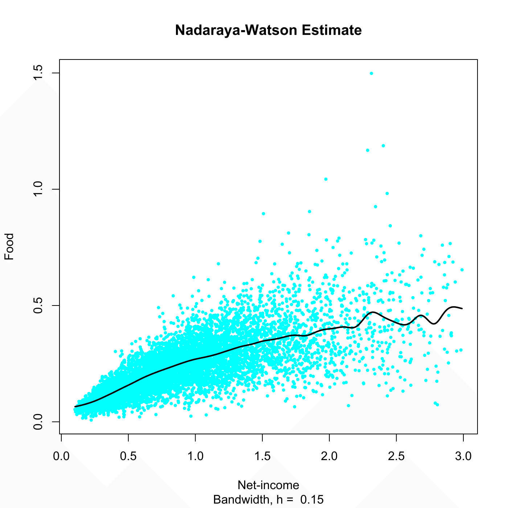

[](http://quantlet.de/)

## [](http://quantlet.de/) **SPMnadwaest** [](http://quantlet.de/)

```yaml

Name of QuantLet : SPMnadwaest

Published in : Nonparametric and Semiparametric Models

Description : Computes the Nadaraya-Watson estimator for the UK 1973 expenditure data.

Keywords : 'Nadaraya Watson, estimation, financial, plot, graphical representation, data
visualization'

See also : SPMlocpolyest, SPMderivest

Author : Awdesch Melzer

Submitted : Wed, December 12 2012 by Dedy Dwi Prastyo

Datafiles : agg73sh.dat

```




### R Code:
```r

# clear variables and close windows
rm(list = ls(all = TRUE))
graphics.off()

# load data
x = read.table("agg73sh.dat")

h = 0.15
# nadaraya watson kernel regression employing gaussian kernel
mh = ksmooth(x[, 1], x[, 4], kernel = "normal", bandwidth = h)

# plot
plot(x[, 1], x[, 4], pch = 20, col = "cyan", xlab = "Net-income", ylab = "Food", cex = 0.7, 
    sub = paste("Bandwidth, h = ", h))
title("Nadaraya-Watson Estimate")
lines(mh, lwd = 2)


```
