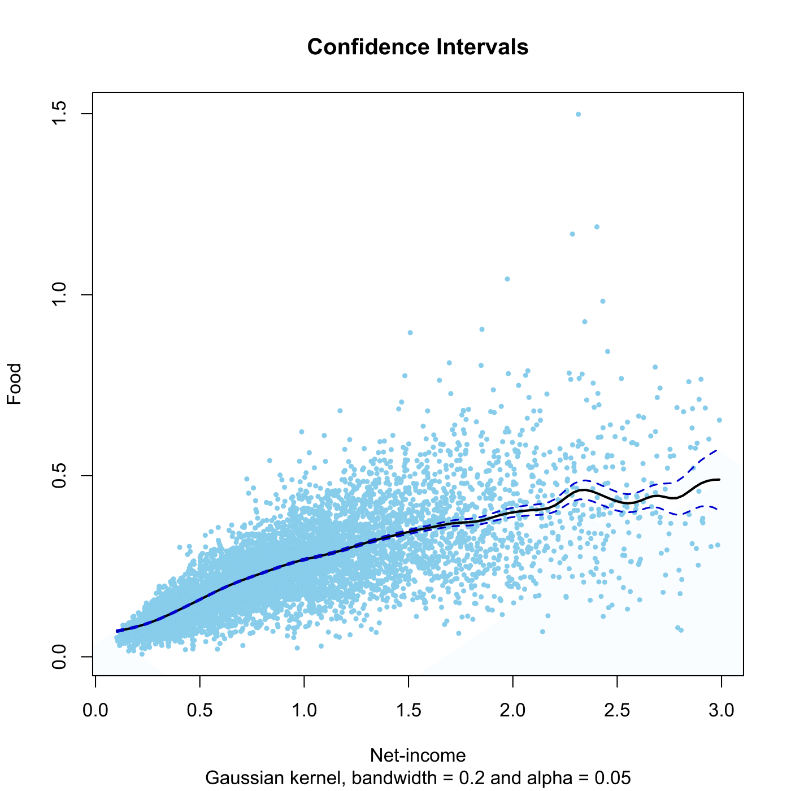

[](http://quantlet.de/)

## [](http://quantlet.de/) **SPMengelconf** [](http://quantlet.de/)

```yaml

Name of QuantLet : SPMengelconf

Published in : Nonparametric and Semiparametric Models

Description : 'Computes a kernel regression and confidence intervals for the regression of food
expenditures on net-income for the UK 1973 expenditure data.'

Keywords : 'kernel, nonparametric, regression, confidence-interval, plot, graphical representation,
data visualization'

See also : SPMengelcurve, SPMengelcurve1, SPMengelconfsample, SPMspline, SPMsplineregression

Author : Awdesch Melzer, Stephanie Freese

Submitted : Wed, December 19 2012 by Dedy Dwi Prastyo

Datafiles : agg73sh.dat

```




### R Code:
```r

# clear variables and close windows
rm(list = ls(all = TRUE))
graphics.off()

regci = function(x, h, alpha) {
    x = as.matrix(x)
    if (ncol(x) != 2) {
        stop("regci: cols(x) <> 2")
    }
    if (missing(h)) {
        h = (max(x[, 1]) - min(x[, 1]))/5
    }
    if (missing(alpha)) {
        alpha = 0.05  # default confidence level is 0.05    
    }
    # parameters for normal Kernel from Canonical Bandwidth
    dK = 0.77639
    cK = 0.28209
    mK = 1
    n = nrow(x)
    mh = ksmooth(x[, 1], x[, 2], bandwidth = h, kernel = "normal", n.points = 100)
    sh = ksmooth(x[, 1], (x[, 2]^2), bandwidth = h, kernel = "normal", n.points = 100)
    sh = sh$y - mh$y^2  # estimate for var(x[,2]|x[,1])
    fh = density(x[, 1], bw = h, cut = 1, kernel = "gaussian", n = 100)
    calpha = qnorm(1 - alpha/2)
    mrg = calpha * sqrt(cK * sh/((n * h) * fh$y))
    clo = cbind(mh$x, (mh$y - mrg))
    cup = cbind(mh$x, (mh$y + mrg))
    return(list(mh = cbind(mh$x, mh$y), clo = clo, cup = cup))
}

# load data
x = read.table("agg73sh.dat")
x = x[, c(1, 4)]

h = 0.2  # bandwidth
alpha = 0.05  # 1-alpha confidence level
est = regci(x, h, alpha)  # estimation of pointwise confidence intervals

# plot
plot(x, type = "n", xlab = "Net-income", ylab = "Food", main = "Confidence Intervals", 
    sub = paste("Gaussian kernel, bandwidth =", h, "and alpha =", alpha))
points(x, col = "skyblue", pch = 20, cex = 0.7)
lines(est$mh, lwd = 2)
lines(est$clo, lwd = 1.5, col = "blue3", lty = "dashed")
lines(est$cup, lwd = 1.5, col = "blue3", lty = "dashed")

```
