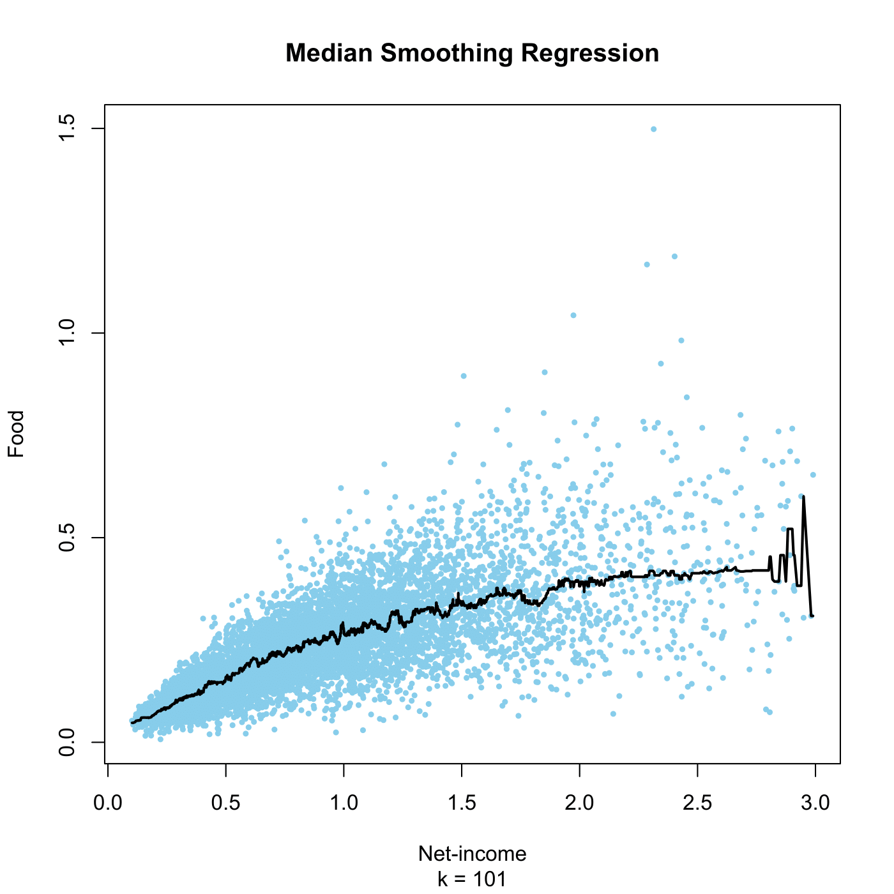

[](http://quantlet.de/)

## [](http://quantlet.de/) **SPMmesmooreg** [](http://quantlet.de/)

```yaml

Name of QuantLet : SPMmesmooreg

Published in : Nonparametric and Semiparametric Models

Description : 'Computes the median smoother of food expenditures on netincome for the UK 1973
expenditure data.'

Keywords : 'regression, median, smoothing, financial, plot, graphical representation, data
visualization'

See also : SPMwavereg, SPMknnreg

Author : Awdesch Melzer

Submitted : Wed, January 09 2013 by Dedy Dwi Prastyo

Datafiles : agg73sh.dat

```




### R Code:
```r

# clear variables and close windows
rm(list = ls(all = TRUE))
graphics.off()

# load data
x = read.table("agg73sh.dat")

k = 101
mk = runmed(x[, 4], k, endrule = "median")

# plot
plot(x[, c(1, 4)], type = "n", sub = paste("k =", k), xlab = "Net-income", ylab = "Food")
title("Median Smoothing Regression")
points(x[, c(1, 4)], col = "skyblue", pch = 20, cex = 0.7)
lines(x[, 1], mk, col = "black", lwd = 2)


```
