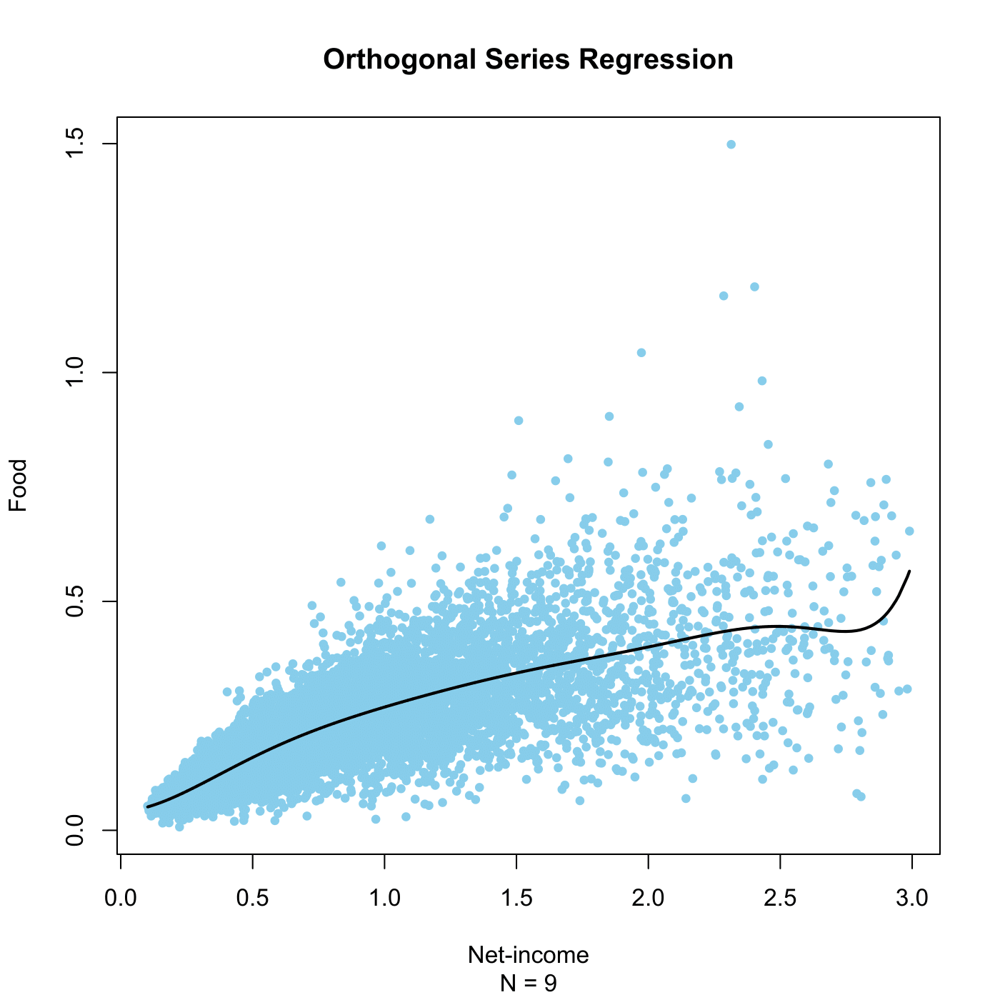

[](http://quantlet.de/)

## [](http://quantlet.de/) **SPMorthogon** [](http://quantlet.de/)

```yaml

Name of QuantLet : SPMorthogon

Published in : Nonparametric and Semiparametric Models

Description : 'Computes the an orthogonal series regression food expenditures on net-income for the
UK 1973 expenditure data.'

Keywords : 'nonparametric, orthogonal series, regression, plot, graphical representation, data
visualization'

See also : SPMregress, SPMkernelregression

Author : Awdesch Melzer

Submitted : Wed, January 16 2013 by Maria Osipenko

Datafiles : agg73sh.dat

```




### R Code:
```r

# clear variables and close windows
rm(list = ls(all = TRUE))
graphics.off()

# Legendre Polynomial function
legendre = function(x, k) {
    # x is a vector of size: (nx1) k is the polynomial order (skalar)
    n = length(x)
    if (k == 0) {
        px = (matrix(1, n, 1)/sqrt(2))
    } else {
        px = cbind((matrix(1, n, 1)/sqrt(2)), (sqrt(3) * x/sqrt(2)))
        j = 1L
        while (j < k) {
            j = j + 1L
            p0 = px[, j - 1]
            p1 = px[, j]
            px = cbind(px, (((2 * j - 1) * x * p1 - (j - 1) * p0)/j))
        }
    }
    return(px)
}

# load data
x = read.table("agg73sh.dat")
x = x[, c(1, 4)]

k = 9
lx = legendre(x[, 1], k)
b = lm(x[, 2] ~ lx - 1)$coefficients
mo = cbind(x[, 1], (lx %*% b))

# plot
plot(x, type = "n", ylab = "Food", xlab = "Net-income", sub = paste("N =", k))
title("Orthogonal Series Regression")
points(x, pch = 19, col = "skyblue", cex = 0.7)
lines(mo, lwd = 2)

```
