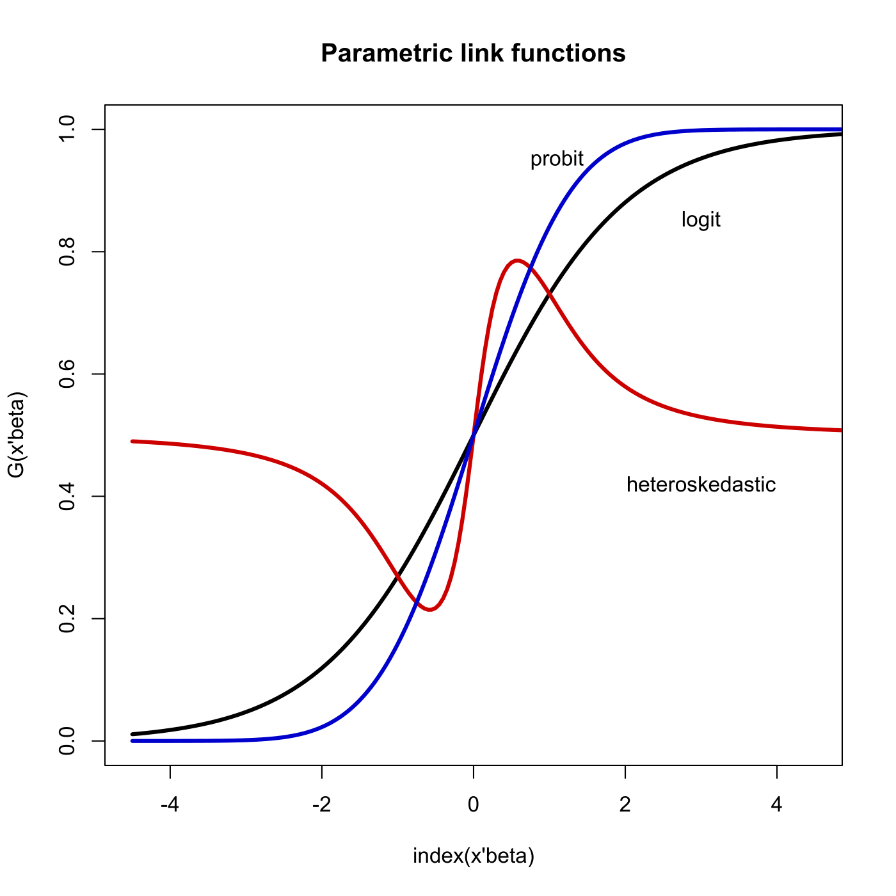

[](http://quantlet.de/)

## [](http://quantlet.de/) **SPMparametriclinkfunctions** [](http://quantlet.de/)

```yaml

Name of QuantLet : SPMparametriclinkfunctions

Published in : Nonparametric and Semiparametric Models

Description : 'Illustrates parametric link functions: logit, probit and heteroskedastic.'

Keywords : logit, heteroskedasticity, parametric, plot, graphical representation

Author : Awdesch Melzer

Submitted : Wed, March 20 2013 by Franziska Schulz

```




### R Code:
```r

# clear variables and close windows
rm(list = ls(all = TRUE))
graphics.off()

x = seq(-4.5, length = 200, by = 0.05)  # grid
logit = cbind(x, (1/(1 + exp(-x))))  # logit function
probit = cbind(x, pnorm(x))  # probit function
horo = cbind(x, (1/(1 + exp(-x/(0.25 * (1 + 2 * x^2 + x^4))))))  # heteroskedastic

# plot
plot(logit, type = "n", xlim = c(-4.5, 4.5), ylim = c(0, 1), xlab = "index(x'beta)", 
    ylab = "G(x'beta)")
title("Parametric link functions")
lines(logit, col = "black", lwd = 3)
lines(horo, col = "red3", lwd = 3)
lines(probit, col = "blue3", lwd = 3)
text(3, 0.85, "logit")
text(1.1, 0.95, "probit")
text(3, 0.42, "heteroskedastic")
```
