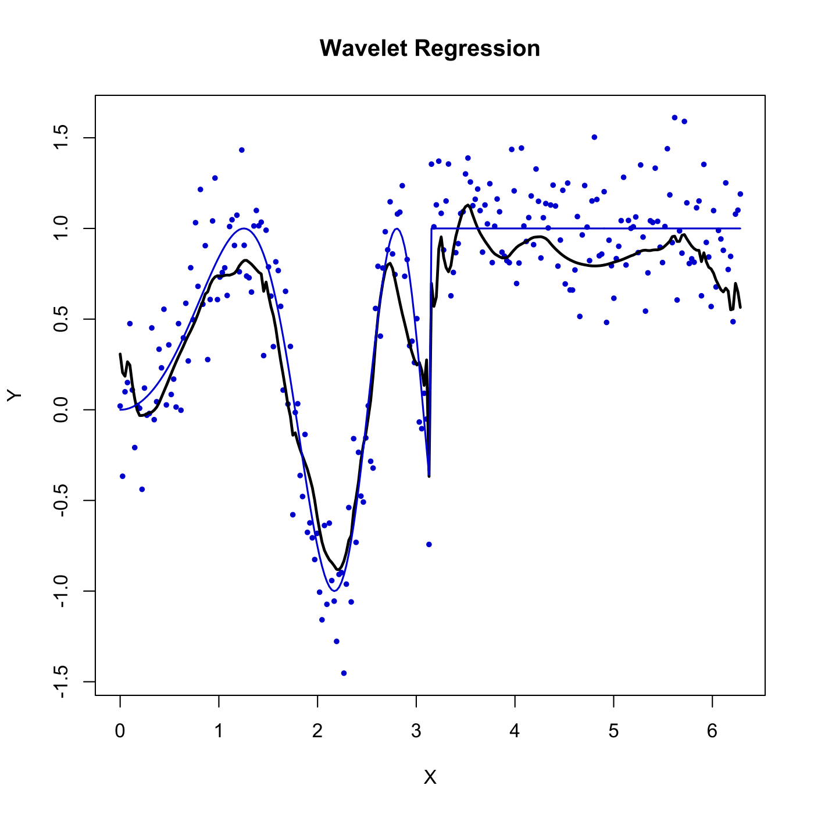

[](http://quantlet.de/)

## [](http://quantlet.de/) **SPMwavereg** [](http://quantlet.de/)

```yaml

Name of QuantLet : SPMwavereg

Published in : Nonparametric and Semiparametric Models

Description : Computes the wavelet regression using Daubechies basis for a simulated data set.

Keywords : regression, simulation, basis, plot, graphical representation

See also : SPMmesmooreg, SPMknnreg

Author : Awdesch Melzer

Submitted : Wed, March 20 2013 by Franziska Schulz

```




### R Code:
```r

# clear variables and close windows
rm(list = ls(all = TRUE))
graphics.off()

# install and load packages
libraries = c("waveslim")
lapply(libraries, function(x) if (!(x %in% installed.packages())) {
install.packages(x)
})
lapply(libraries, library, quietly = TRUE, character.only = TRUE)

# set pseudo random numbers
set.seed(117117)

# parameter settings
n = 256  # number of observations
x = seq(0, by = 2 * pi/(n - 1), length = n)  # grid
m = (x > pi) + sin(x^2) * (x <= pi)  # true funtion
y = m + rnorm(n)/4  # add noise
y.dwt = dwt(y, wf = "d8", 4)  # discrete wavelet transform
mhat = idwt(manual.thresh(y.dwt, 5, 1.9, hard = F))[1:n]  # inverse dwt, with manual threshold 1.9 for smoothness

# plot
plot(x, y, type = "n", ylab = "Y", xlab = "X")
title("Wavelet Regression")
points(x, y, pch = 19, col = "blue3", cex = 0.5)
lines(x, mhat, col = "black", lwd = 2.3)
lines(x, m, col = "blue3", lwd = 1.5)

```
