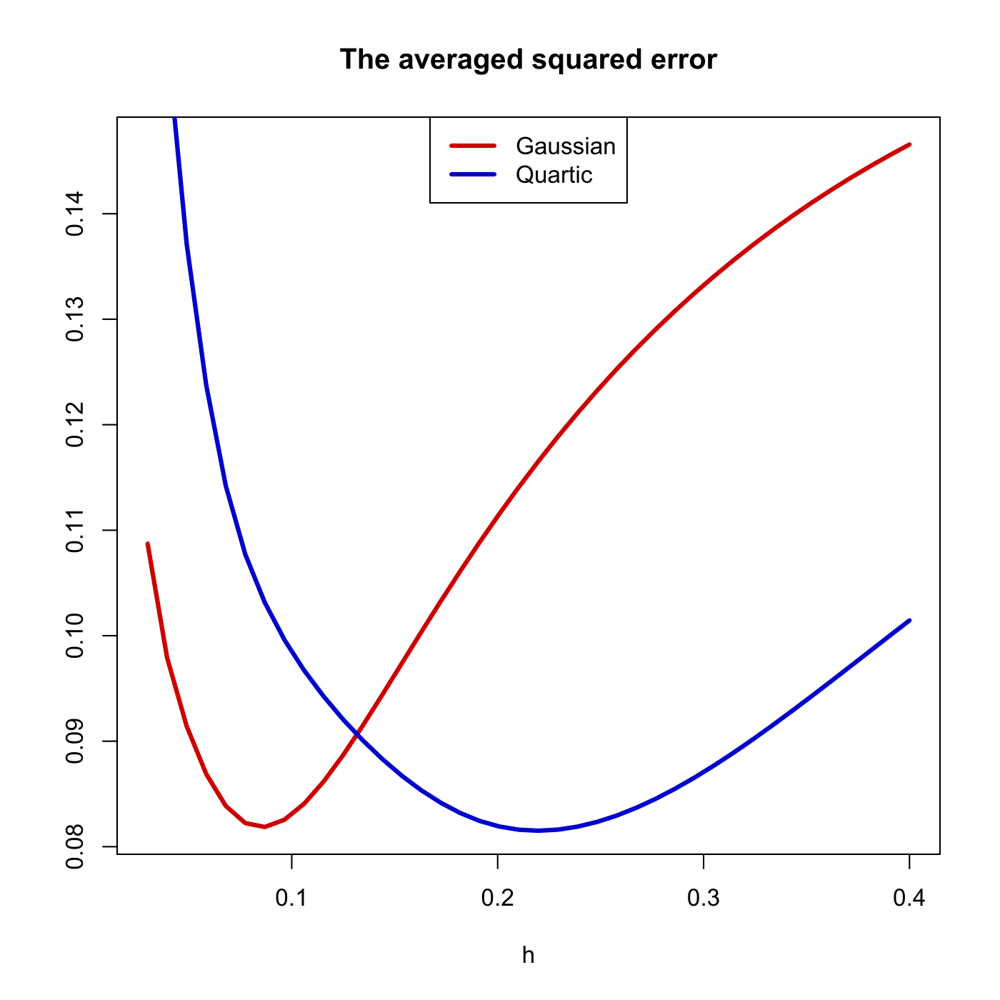

[](http://quantlet.de/)

## [](http://quantlet.de/) **SPMsimase** [](http://quantlet.de/)

```yaml

Name of QuantLet : SPMsimase

Published in : Nonparametric and Semiparametric Models

Description : 'Shows the averaged squared error for the simulated data set with Gaussian (label 1)
and quartic kernel (label 2). The weighted function w(u)=I(|u-0.5|<=0.4) was used. The binwidths h
with minimal ASE (min1, min2) are computed.'

Keywords : 'average squared error, quadratic kernel, simulation, gaussian, plot, graphical
representation'

See also : SPMdensity

Author : Awdesch Melzer

Submitted : Tue, April 16 2013 by Maria Osipenko

```




### R Code:
```r

# clear variables and close windows
rm(list = ls(all = TRUE))
graphics.off()

# SUBROUTINES

# kernel smoothing routine
sker = function(x, y, h, N, f) {
    # kernel regression smoothing for different kernel functions
    
    # kernel functions
    kern = function(x, f) {
        x = as.matrix(x)
        if (f == "gau") {
            # gaussian kernel
            y = dnorm(x)
        } else if (f == "qua") {
            # quadric / biweight kernel
            y = 0.9375 * (abs(x) < 1) * (1 - x^2)^2
        } else if (f == "cosi") {
            # cosine kernel
            y = (pi/4) * cos((pi/2) * x) * (abs(x) < 1)
        } else if (f == "tri") {
            # triweight kernel
            y = 35/32 * (abs(x) < 1) * (1 - x^2)^3
        } else if (f == "tria") {
            # triangular kernel
            y = (1 - abs(x)) * (abs(x) < 1)
        } else if (f == "uni") {
            # uniform kernel
            y = 0.5 * (abs(x) < 1)
        } else if (f == "spline") {
            y = 0.5 * (exp(-abs(x)/sqrt(2))) * (sin(abs(x)/sqrt(2) + pi/4))
        }
        return(y)
    }
    
    # Default parameters
    if (missing(N)) {
        N = 100
    }
    if (missing(f)) {
        f = "qua"
    }
    
    r.n = length(x)
    if (missing(h)) {
        stop("There is no enough variation in the data. Regression is meaningless.")
    }
    r.h = h
    r.x = seq(min(x), max(x), length = N)
    r.f = matrix(0, N)
    for (k in 1:N) {
        z = kern((r.x[k] - x)/h, f)
        r.f[k] = sum(z * y)/sum(z)
    }
    return(list(mx = r.x, mh = r.f))
}
# end sker

# procedure ASE
ASE = function(x, h) {
    # procedure ASE computes the averaged squared
    x = as.matrix(x)
    set.seed(50)
    w = matrix(0, nrow(x))
    tmp1 = matrix(1, length(h))
    tmp2 = matrix(1, length(h))
    
    mx = exp((-1) * (200 * ((x - 0.5)^2))) + 1 - x  # regression curve m(x) 
    ei = rnorm(length(mx))  # standard normal distribution for errors
    y = mx + ei  # y values
    j = 1
    
    w = (abs(x - 0.5) <= 0.4)
    # weighted function
    while (j < (length(h) + 1)) {
        mg = sker(x, y, h[j], N = 100, f = "gau")$mh
        mq = sker(x, y, h[j], N = 100, f = "qua")$mh
        tmp1[j, ] = sum(w * (mg - mx)^2, na.rm = T)  # computes the ASE
        tmp2[j, ] = sum(w * (mq - mx)^2, na.rm = T)
        j = j + 1
    }
    
    tmp1 = tmp1/nrow(x)
    tmp2 = tmp2/nrow(x)
    tmp = cbind(tmp1, tmp2)
    # return(cbind(tmp1, tmp2))
    return(tmp)
}
# end subroutine

set.seed(90)
n = 100
x = runif(n, 0, 1)  # uniform distribution for x values
x = sort(x)
mx = exp((-1) * (200 * ((x - 0.5)^2))) + 1 - x  # regression curve m(x) 
ei = rnorm(n, 0, 1)  # standard normal distribution for errors
y = mx + ei  # y values
h = seq(0.03, 0.4, length = 40)  # vecor of h

TEMP = ASE(x, h)  # calls the procedure ASE

dag = TEMP[, 1]
daq = TEMP[, 2]

ind1 = which(dag == min(dag), arr.ind = T)
ind2 = which(daq == min(daq), arr.ind = T)

dag = cbind(h, dag)
daq = cbind(h, daq)

# plot
plot(dag, type = "l", col = "red3", lwd = 3, xlab = "h", ylab = "")
title("The averaged squared error")
lines(daq, col = "blue3", lwd = 3, lty = 1, type = "l")
legend("top", c("Gaussian", "Quartic"), col = c("red3", "blue3"), lty = c(1, 1), lwd = c(3, 
    3))

min1 = dag[ind1, 1]  # binwidths with the minimal ASE
min2 = daq[ind2, 1]

print("h_opt: gaussian")
min1
print("h_opt: quartic")
min2


```
