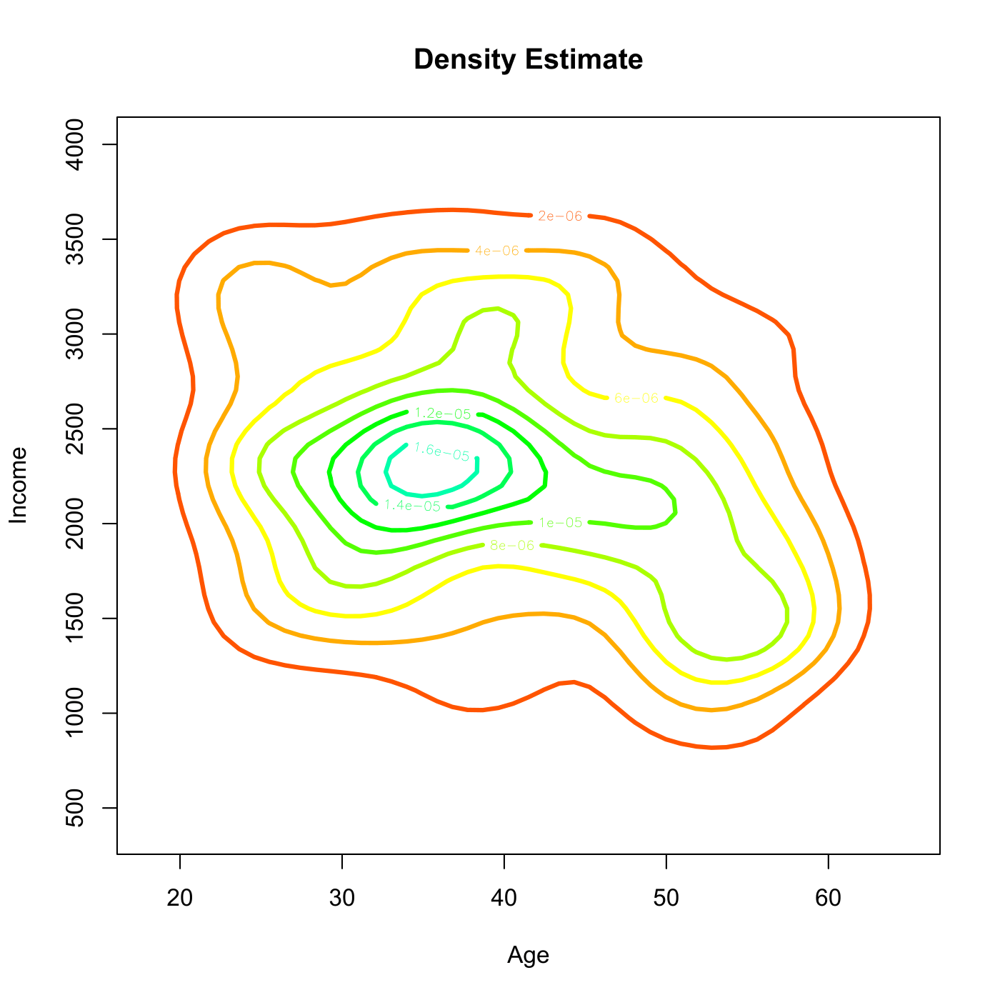

[](http://quantlet.de/)

## [](http://quantlet.de/) **SPMcontour2D** [](http://quantlet.de/)

```yaml

Name of QuantLet : SPMcontour2D

Published in : Nonparametric and Semiparametric Models

Description : 'Estimates a bivariate kernel density for age and income of migration data from
Mecklenburg-Vorpommern, GSOEP 1991. The density estimate is plotted via contour lines in 2D.'

Keywords : 'bivariate, contour, density, estimation, kernel, plot, graphical representation, data
visualization'

See also : SPM2density2D, SPMlogit, SPMmigmvdesc

Author : Awdesch Melzer

Submitted : Fri, June 14 2013 by Awdesch Melzer

Datafiles : migmv.dat

```




### R Code:
```r

# clear variables and close windows
rm(list = ls(all = TRUE))
graphics.off()

# install and load packages
libraries = c("KernSmooth")
lapply(libraries, function(x) if (!(x %in% installed.packages())) {
install.packages(x)
})
lapply(libraries, library, quietly = TRUE, character.only = TRUE)

# load data
x = read.table("migmv.dat")
x = x[, c(2, 7)]  # select Age and Income

a = apply(x, 2, min)
b = apply(x, 2, max)
n = nrow(x)

# grid
for (i in 1:2) {
    assign(paste("grid", i, sep = ""), seq(a[i], b[i], length = 51))
}

h = 1.06 * c(sd(x[, 1]), sd(x[, 2])) * length(x[, 1])^(-1/5)  # rule-of-thumb bandwidth's

# density estimate
fh = bkde2D(x, bandwidth = h)$fhat

# contour plot
contour(x = grid1, y = grid2, fh, xlab = "Age", ylab = "Income", main = "Density Estimate", 
    col = rainbow(18), lwd = 3)
```
