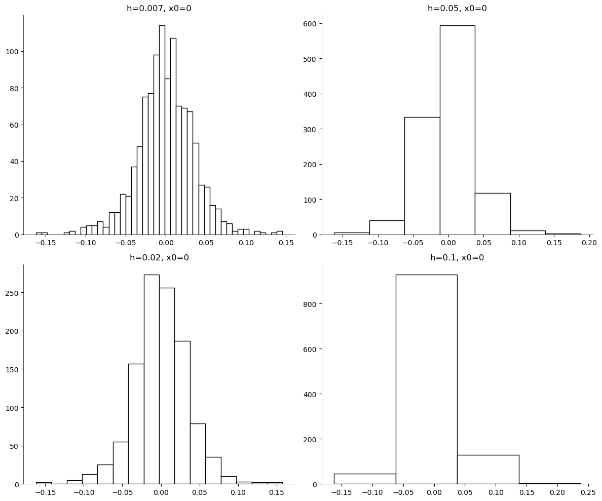

[](http://quantlet.de/)

## [](http://quantlet.de/) **SPMhisto_diff_binwidth** [](http://quantlet.de/)

```yaml


Name of QuantLet : 'SPMhisto_diff_binwidth'

Published in : 'Nonparametric and Semiparametric Models'

Description : 'Illustrates four histograms for the stock returns data with different bin-widths .'

Keywords : 'plot, graphical representation, data visualization, histogram, financial, returns, asset'

See also : 'SPMstockreturnhisto, SPMhistogram, SPMashstock, SPMbuffahisto, SPMHistoConstruct,
SPMhistobias2'

Author : 'Ștefan Găman'

Submitted : '27 May 2024'

Datafiles : 'stockres.dat'

```

