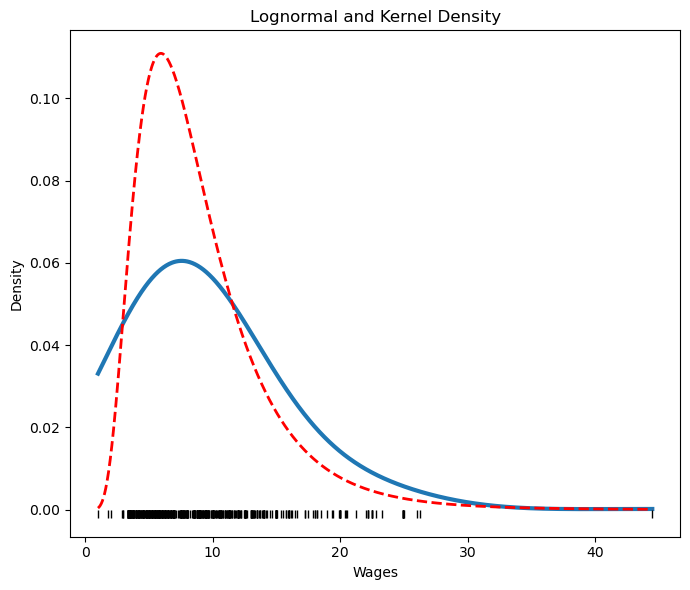
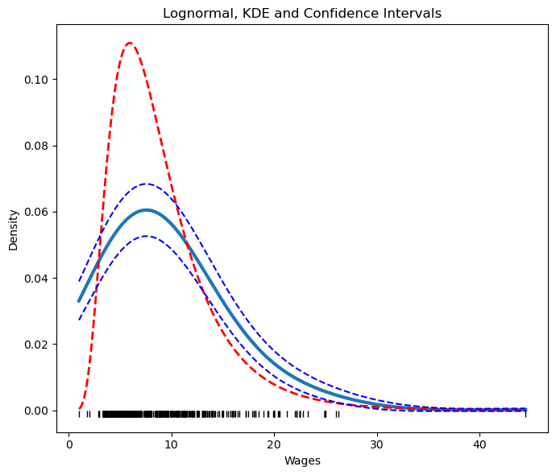
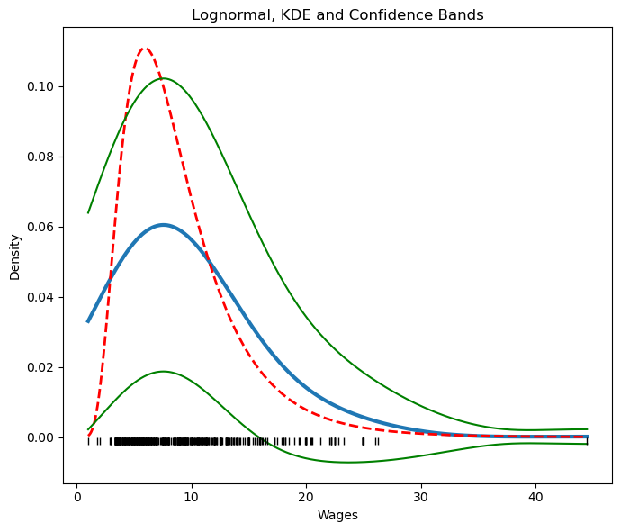
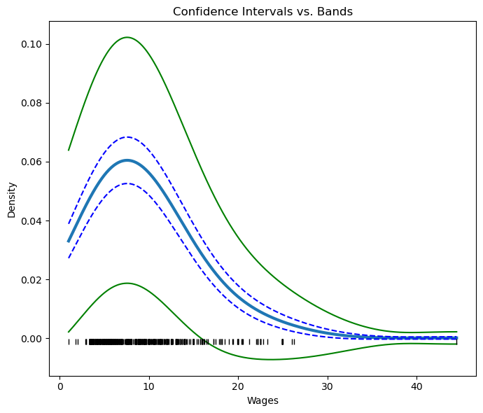

[](http://quantlet.de/)

## [](http://quantlet.de/) **QID-2707-SPMcps85** [](http://quantlet.de/)

```yaml

Name of QuantLet : 'QID-2707-SPMcps85'

Published in : 'Nonparametric and Semiparametric Models'

Description : 'Illustrates the parametric and nonparametric kernel density estimations of avergared hourly earnings along with confidence bands and intervals.'

Keywords : 'kernel density, parametric, nonparametric, kernel, confidence bands, confidence intervals'

Author : 'Ștefan Găman'

Submitted : '11 Jul 2024'

```









### [IPYNB Code: QID-2707-SPMcps85.ipynb](QID-2707-SPMcps85.ipynb)


automatically created on 2024-07-12