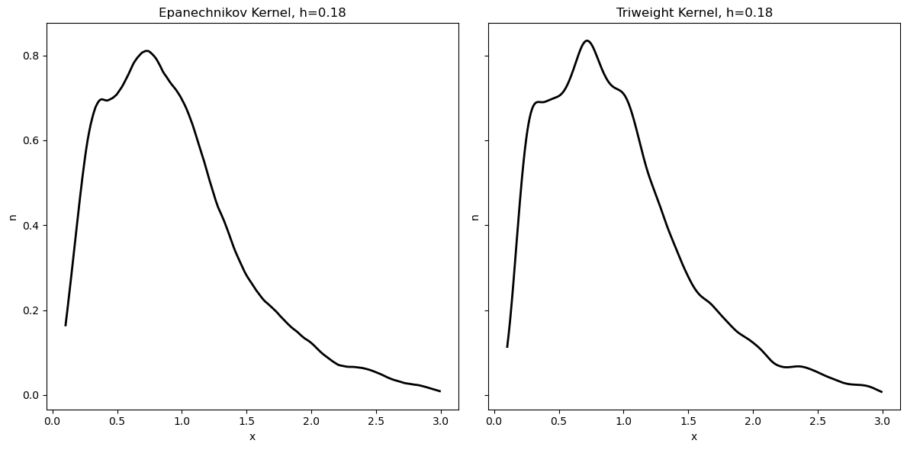

[](http://quantlet.de/)

## [](http://quantlet.de/) **QID-2707-SPMdiffkernels_Epanechikov_Triweight** [](http://quantlet.de/)

```yaml

Name of QuantLet : 'QID-2707-SPMdiffkernels_Epanechikov_Triweight'

Published in : 'Nonparametric and Semiparametric Models'

Description : 'Illustrates two Different continuous kernels, net-income data from the U.K. Family Expenditure Survey.'

Keywords : 'plot, graphical representation, data visualization, histogram, financial, returns, asset'

Author : 'Ștefan Găman'

Submitted : '08 Jul 2024'

Datafiles : 'agg73sh.dat'

```



### [IPYNB Code: QID-2707-SPMdiffkernels_Epanechikov_Triweight.ipynb](QID-2707-SPMdiffkernels_Epanechikov_Triweight.ipynb)


automatically created on 2024-07-09