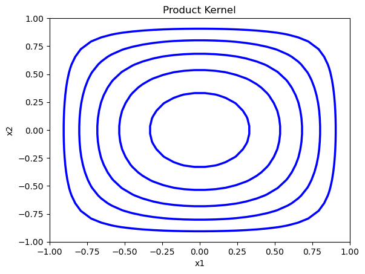
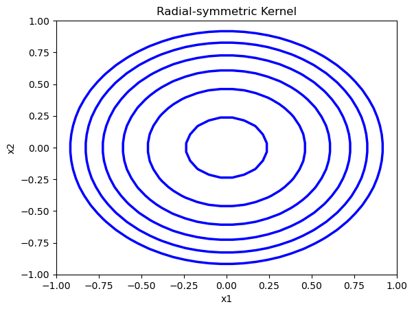
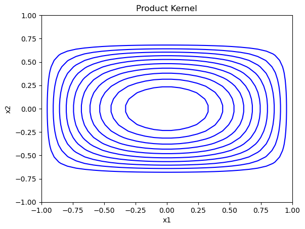
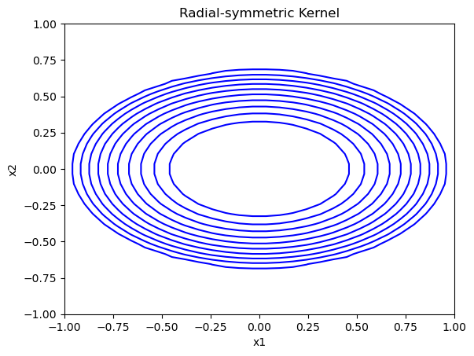
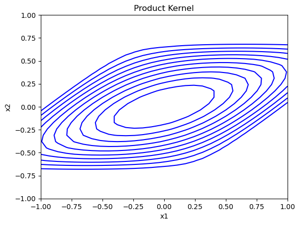
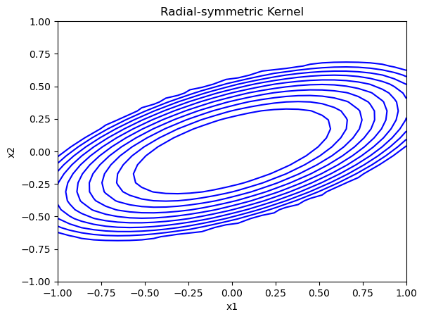

[](http://quantlet.de/)

## [](http://quantlet.de/) **QID-2707-SPMkernelcontours_all** [](http://quantlet.de/)

```yaml

Name of QuantLet : 'QID-2707-SPMkernelcontours_all'

Published in : 'Nonparametric and Semiparametric Models'

Description : 'Illustrates the difference between a bivariate product and a bivariate radial-symmetric Epanechnikov kernel with equal bandwidths.'

Keywords : 'Epanechnikov, contour, bivariate, multivariate, kernel, plot, graphical representation, data visualization'

Author : 'Ștefan Găman'

Submitted : '08 Jul 2024'

```













### [IPYNB Code: QID-2707-SPMkernelcontours_all.ipynb](QID-2707-SPMkernelcontours_all.ipynb)


automatically created on 2024-07-09