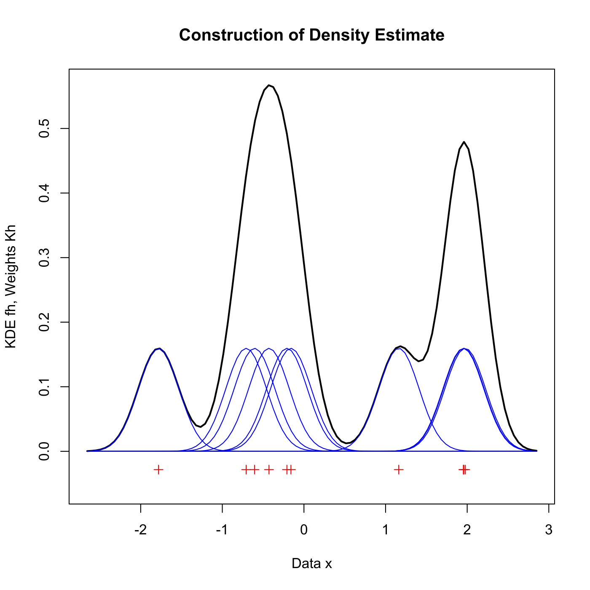

[](http://quantlet.de/)

## [](http://quantlet.de/) **SPMkdeconstruct** [](http://quantlet.de/)

```yaml

Name of QuantLet : SPMkdeconstruct

Published in : Nonparametric and Semiparametric Models

Description : Visualizes the construction of a kernel density estimate for a Gaussian kernel.

Keywords : plot, graphical representation, kernel, density, kde, gaussian

See also : SPMkdemse, SPMkdebias, SPMkdebias_sim, SPMkde2D, SPMkdeconstruct-Sliders

Author : Marlene Mueller

Submitted : Tue, March 16 2010 by Lasse Groth

Example : Graphical representation of the summation over the rescaled kernels.

```




### R Code:
```r

# clear variables and close windows
rm(list = ls(all = TRUE))
graphics.off()

# parameter settings
h = 0.25  # binwidth selection
n = 10    # number of observations

x = rnorm(n)  # Observations

xr = diff(range(x))
ng = 100
xg = (xr + 7 * h) * (0:(ng - 1))/(ng - 1) + min(x) - 3.5 * h

fk = matrix(0, nrow = ng, ncol = n)

# Kernel estimation
for (j in 1:n) {
    fk[, j] = dnorm((xg - x[j])/h)/(n * h)  # Gaussian kernel
}
fh = rowSums(fk)  # Kernel density estimate

# plot
ylim = c(-0.1 * max(fh), max(fh))  # Set limits for y axis
plot(xg, fh, type = "l", lwd = 2, ylim = ylim, main = "Construction of Density Estimate", 
    xlab = "Data x", ylab = "KDE fh, Weights Kh")
points(cbind(x, rep(-0.05 * max(fh), n)), col = "red", pch = 3)
for (j in 1:n) {
    lines(xg, fk[, j], col = "blue")
}
```
